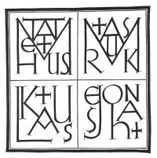
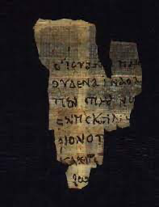
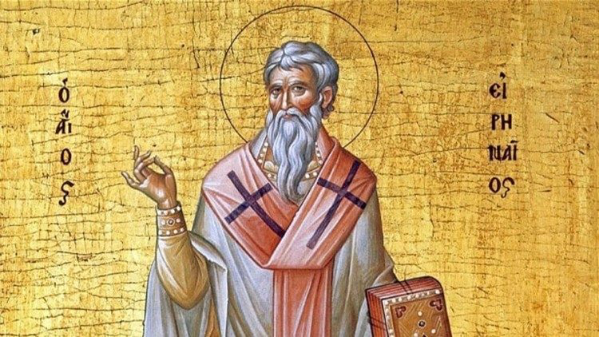
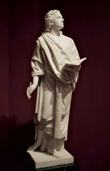

# The Gospel of John: Overview and Authorship 約翰福音—概論和作者
Barry Lee 李萬基 2022.05.01

## Introduction 引言
- Synoptic Gospels 同觀福音 vs the Fourth Gospel 第四福音

	- Synoptic Gospels 同觀福音：Matthew 馬太、Mark  馬可、Luke 路加
	- the Fourth Gospel 第四福音：John 約翰
	- What are the differences between Synoptic Gospels and the Fourth Gospel? 同觀福音和第四福音有什麼分別？
- **Activity: Language differences between the four Gospels  四福音用字比較**
	- Find 1-2 partners to fill in the "most 最多" or "least 最少"
- Answer

#### Overview of today
- Part I: what, why, how, when, where and who? 第一部份：約翰福音是什麼？為何而寫？ 怎樣傳達？什麼時候寫？在那裡寫？寫給誰？
- Part II: the big 'who' question—authorship 第二部份：重要的問題是——誰是作者？

#### The "What" and "Why" of the Gospels  福音書是什麼？為何而寫？
- What is a gospel? 福音書是什麼？
	- Jesus's biography 耶穌的傳記
- "The word _euangelion_ [in the Greco-Roman world] was also used regularly in the context of a messenger bringing a report of victory. A battle is won, and a messenger is sent to report the news to his people or king. A _euangelion_ was good news of some significance, usually in the context of announcement [of a victory] or ensuing celebration. _Euangelion_ 這詞語描述[在希臘-羅馬世界]差使傳達勝利報告。 戰爭勝利了，使者就被派去向他的人民或國王報告消息。 _euangelion_ 是具有某種重大意義的好消息，通常用於宣布戰勝或慶典的情況下。"[^1]
- The Gospels as Ancient Biography 將福音書看作古代人物傳記
- **"Reading the Gospels as ancient biography leads us to expect the depiction of one person, the subject, understood by another person, the author. 將福音書當作古代人物傳記來讀時，我們會看主人翁怎樣被作者理解。"**[^2]
- "[I]t is incorrect to describe ancient biography as an account of the life of an individual from birth to death. Some biographies begin with the hero’s **mature life** 將古代人物傳記視為一個人從出生到死亡的記錄並不正確。 有些傳記以主人翁的**已長大成人**作開頭。"
	- compare with biographies in *Moral Leadership*
- "[T]here is virtually no interest in tracing personality or **character development**. 古代人物傳記幾乎沒有興趣勾劃主人翁個性或**作為故事主角的發展**。"
- "[T]he literary form in which “lives” are presented varies. The dominant form is a prose narrative similar to history except that it is anecdotal and unconcerned about cause and effect. 古代人物傳記的文學形式各有不同，主要形式是類似歷史的散文敘事，只是它主要記載軼事，而不在意於因果關係。"
- "[A]ncient biographies perform a **multiplicity of social functions**. Some apparently had only a literary aim (e.g., Laertius). Others seemed to serve a propagandistic purpose of some sort. 古代人物傳記具有**多重社會功能**。 有些只有文學目的，但其他似乎含有某種宣傳目的。"[^3]
- "If our description of what is essential and what is accidental in ancient biography holds true, then it is possible to say [ancient biography] **depicts the essence of a significant person, that is, to expose what sort of person it really is.** 如果我們對古代傳記「重要」和「次要」的內容理解是正確的，那麼我們可以說... 古代傳記**描繪一個重要人物的本質，就是展示他到底是一個什麼樣的人。**"
- "**John employs the myth of a descending-ascending redeemer** 約翰用一個神話般的描述，展示了這位降下、而又高升的救贖者。"[^4]

#### The "How" — the oral tradition 口傳心授
- "For years now, Gospel studies have been dominated by the mistaken assumption that since the Gospels are written texts, they generally function similarly to print-based texts in modern times. 多年來，福音書研究一直被一個錯誤的假設所主導，即由於福音書是書面文本，它們的功能通常與現代書本相似。"
- "The reader would then read/perform the written text to a gathering of people. In this way, all the people of a community, literate or not, could gain access to the contents of written texts. And so, both in composition and reception, ancient written texts were also both oral (spoken) and aural (heard) phenomena. 宣讀聖經的人會在會眾聚集時讀出經文。 通過這種方式，社區中的所有人，無論識字與否，都可以認識經文的內容。 因此，無論對於作者還是受眾，古代文本是既在乎口述，也是在乎從聲音裏聽到的一種現象。"[^5]
- "In terms of composition, the four Gospels each appear to fall somewhere along the continuum between a straightforward transcription of an actual oral performance, on the one hand, and a “literary” work with roots in the oral Jesus tradition, on the other. 就寫作過程而言，四福音書似乎都落在了一個光譜之間，一端是口傳心授的直接記錄，另一端是像“文學”作品的寫作。"[^6]

#### When and where? 何時何處？
- "The earliest textual witnesses to the Gospel of John are papyri from Egypt, above all the so-called Rylands fragment, or P52, consisting of John 18:31–33, 37–38 (the earliest known fragment of any New Testament book), from the first half of the second century, and the Bodmer papyri (P66 and P75), from the early third century. 約翰福音最早的文字記錄是來自埃及的莎草紙，最重要的是 Rylands 片段，或 P52，由約翰福音 18:31-33、37-38（已知最早的任何新約書卷）組成，檢測年份是二世紀上半葉。 另外也有從三世紀初的 Bodmer 莎草紙（P66 和 P75）" [^7]
	- 
- Timeline 時間線
	- Irenaeus 愛納內 (a priest 早期主教, ca. 200): "John [] lived on at Ephesus into the reign of Trajan (98–117). 約翰 [] 在以弗所活到圖拉真統治時期(98–117)。" 
	- The disciple responsible for the Gospel is dying or has died (cf. John 21:20–24)... one might settle on a plausible date of ca. 100 for the _final redaction_ of the Gospel  約翰福音 21：20-24 ： 寫作福音的那位門徒差不多死去或已經死去 (cf. John 21:20–24)... 人們可能會確定一個合理的日期，大約是主後100年是福音的_最終修訂_。.
	- Tradition 根據傳統: 
		- written circa 40–60 寫作
		- 1st edition 第一版完成: 70–85 (very uncertain 非常不確定)
		- Final form 最後成形時間: AD 75 to 110 or 90 to 100 [^8]

#### For whom? 為誰而寫? 
- the "Johannine community" (使徒)約翰所牧養的門徒群體

## Authorship 來源

#### Author and editor(s) 作者與編輯
- **Jn 21:24** This is the disciple who is bearing witness about these things, and who has written these things, and ***we*** know that his testimony is true. (ESV) 約21:24 這門徒就是為這些事作見證、並且記載這些事的，**我們**知道他的見證是真的。(和修版)
- "The Gospel of John is claiming to be more than the product of this disciple’s testimony; it is claiming him as its actual author, not necessarily in the sense that he “wrote” it with his own hand (any more than Pilate wrote the title, or Paul the letter to the Romans with their own hands), but in the sense that he composed it and takes full responsibility for its content. 約翰福音不僅僅是「這位門徒」的見證，書中聲稱他就是這福音的真正作者，但其實不一定是他親手“寫”的（就像彼拉多為耶穌的「罪狀」親手題筆，或保羅寫給羅馬人的信一樣），但在某程度上他撰寫並對其內容承擔全部責任。"[^9]
- "the Gospel’s author and its narrative voice are not exactly the same. 福音的作者和「旁白」的聲音並不完全相同。"[^10]
- "Brown argued that the Fourth Gospel and the Johannine letters were written by two different people and reflect different circumstances (Brown, _Epistles_, 30). 布朗認為，第四福音和約翰書信是由兩個不同的人寫的，反映了不同的社會情況。"[^11]
	• Rather than a single author, these documents reflect the inspiration and tradition of the Apostle John handed down through a group of disciples. 這些文件不是一個作者，而是反映了使徒約翰通過一群門徒傳下來的靈感和傳統。
	• The followers of the Apostle John published the final version of the Gospel at Ephesus after his death, ca. ad 85. 使徒約翰的追隨者在他死後在以弗所出版了福音的最終版本，約於公元85年。
	• The Apostle John’s disciples may or may not have been involved in the writing of the (later) letters of John (Smalley, _1, 2, 3 John_, xxii) 使徒約翰的門徒可能、也可能沒有參與約翰（後來的）書信的撰寫.[^12]

#### So what? 那又如何？
- This appearance of the "we" in John 21 rejects a common thought that God's word comes from a single instance of inspiration. God's Inspiration can be a long process. This helps us appreciate how other books in the Bible came into being. There might be authors, editors, even ghost writers, all involved in the composition process. 約翰福音的這個「我們」的出現否定了一個普遍的想法，即上帝的話語來自單一次的感動而寫下。 上帝的啟示可以是一個漫長的過程。 這有助於我們了解聖經中其他書卷是如何產生的。當中可以有作者，有編者，也有代筆的人， 是一個合成的過程。

#### Who is the Beloved Disciple (BD)? 誰是「主所愛的門徒」?

###### Relevant passages 相關經文
- "13:23 One of them, the disciple whom Jesus loved, was reclining next to him. 24 Simon Peter motioned to this disciple and said, “Ask him which one he means.25 Leaning back against Jesus, he asked him, “Lord, who is it? 23 門徒中有一個人，是耶穌所愛的，側身挨近耶穌的胸懷。 24 西門．彼得就對這個人示意，要問耶穌是指著誰說的。 25 於是那人緊靠著耶穌的胸膛，問他：「主啊，是誰呢？」”
- "19:26 When Jesus saw his mother and **the disciple whom he loved** standing nearby, he said to his mother, “Woman, behold, your son!” **27** Then he said to the disciple, “Behold, your mother!” And from that hour the disciple took her to his own home. 26 耶穌見母親和**他所愛的那門徒**站在旁邊，就對母親說：「母親，看，你的兒子！」 27 又對那門徒說：「看，你的母親！」從那刻起，那門徒就接她到自己家裏去了。"
- "20:2 2 So she came running to Simon Peter and **the other disciple, the one Jesus loved**, and said, “They have taken the Lord out of the tomb, and we don’t know where they have put him!” 3 So Peter and the other disciple started for the tomb. 4 Both were running, but the other disciple outran Peter and reached the tomb first. 5 He bent over and looked in at the strips of linen lying there but did not go in. 6 Then Simon Peter came along behind him and went straight into the tomb. He saw the strips of linen lying there, 7 as well as the cloth that had been wrapped around Jesus’ head. The cloth was still lying in its place, separate from the linen. 8 Finally the other disciple, who had reached the tomb first, also went inside. He saw and believed. 9 (They still did not understand from Scripture that Jesus had to rise from the dead.) 10 Then the disciples went back to where they were staying. 2 就跑來見西門．彼得和**耶穌所愛的那個門徒**，對他們說：「有人從墳墓裏把主移走了，我們不知道他們把他放在哪裏。」 3 彼得和那門徒就出來，往墳墓去。 4 兩個人同跑，那門徒比彼得跑得快，先到了墳墓， 5 低頭往裏看，看見細麻布還放在那裏，只是沒有進去。 6 西門．彼得隨後也到了，進了墳墓，看見細麻布放在那裏， 7 又看見耶穌的裹頭巾沒有和細麻布放在一起，是另在一處捲著。 8 然後先到墳墓的那門徒也進去，他看見就信了。 9 他們還不明白聖經所說耶穌必須從死人中復活的意思。 10 於是兩個門徒回自己的住處去了。"
- "21:7 Then **the disciple whom Jesus loved** said to Peter, “It is the Lord!” As soon as Simon Peter heard him say, “It is the Lord,” he wrapped his outer garment around him (for he had taken it off) and jumped into the water. 7 **耶穌所愛的那門徒**對彼得說：「是主！」那時西門．彼得赤著身子，一聽見是主，就束上外衣，跳進海裏。"
- "21:20 Peter turned and saw that the disciple whom Jesus loved was following them. (This was the one who had leaned back against Jesus at the supper and had said, “Lord, who is going to betray you?”) 21 When Peter saw him, he asked, “Lord, what about him?” 22 Jesus answered, “If I want him to remain alive until I return, what is that to you? You must follow me.” 23 Because of this, the rumor spread among the believers that this disciple would not die. But Jesus did not say that he would not die; he only said, “If I want him to remain alive until I return, what is that to you? 24 This is the disciple who testifies to these things and who wrote them down. We know that his testimony is true. 20 彼得轉過身來，看見**耶穌所愛的那門徒**跟著，就是在晚餐時靠著耶穌胸膛說「主啊，出賣你的是誰」的那門徒。 21 彼得看見他，就問耶穌：「主啊，這個人怎樣呢？」 22 耶穌對他說：「假如我要他等到我來的時候還在，跟你有甚麼關係呢？你跟從我吧！」 23 於是這話在弟兄中間流傳，說那門徒不死。其實，耶穌不是說他不死，而是對彼得說：「假如我要他等到我來的時候還在，跟你有甚麼關係呢？」 24 這門徒就是為這些事作見證、並且記載這些事的，我們知道他的見證是真的。"

###### John, son of Zebedee 西庇太兒子約翰
- **Irenaeus**, near the end of the century, after recounting the traditions about the other three Gospels, concluded, “Afterwards, John, the disciple of the Lord, who also leaned upon His breast, did himself publish a Gospel during his residence at Ephesus in Asia. **愛納內**，在第二世紀末，在講述了其他三本福音書的傳統之後，總結道：“後來，主的門徒約翰也靠在他的胸前，他住在亞細亞的以弗所時讓福音書面世。”[^13]
	- 
	- Echoes Jn 13:23 One of them, the disciple whom Jesus loved, was reclining next to him. 門徒中有一個人，是耶穌所愛的，側身挨近耶穌的胸懷。
- John, James (his brother), Peter, Andrew: first four disciples 約翰、雅各（他的兄弟）、彼得、安德烈：首四位門徒
- “the Church in Ephesus, founded by Paul, and having John remaining among them permanently until the time of Trajan (circa 100AD), is a true witness of the tradition of the apostles. 保羅創立以弗所教會，後來約翰長期留在他們中間直到圖拉真時代（約主後100年），是使徒傳統的真實見證。”[^14]
- CON 1 — Jn 21:2, Simon Peter, Thomas (also known as Didymus), Nathanael from Cana in Galilee, the **sons of Zebedee**, and two other disciples were together. 西門‧彼得、叫低土馬的多馬、加利利的迦拿人拿但業、**西庇太的兩個兒子**，和另外兩個門徒，都在一起。; Mk 3:17 James son of Zebedee and his brother John (to them he gave the name Boanerges, which means “**sons of thunder**”) 還有西庇太的兒子雅各和雅各的弟弟約翰—耶穌又給他們起名叫半尼其，就是**雷的兒子**"
- almost always **act together**: at the raising of Jairus’s daughter (Mk 5:37//Lk 8:51), at the transfiguration (Mt 17:1//Mk 9:2//Lk 9:28), on the Mount of Olives (Mk 13:3), and in the garden of Gethsemane (Mt 26:37//Mk 14:33). 幾乎總是**一起行動**：在睚魯的女兒復活時（可 5:37//路 8:51）， 在登山變像時（太 17:1//可 9:2//路 9:28），在橄欖山（可 13:3）和客西馬尼園（太 26:37//可 14:33）。 [^15]
- "And like the synoptic writers, he views them as a pair, not as individuals. This undercuts the notion that he is himself one of them. 和同觀福音作者們一樣，約翰福音作者將他們視為一對，而不是個人。這削弱了他自己就是其中之一的理據。"[^16]
- CON 2 — "In one, Jesus says to Judas, “What you are doing, do quickly!” and the disciple (as author) adds that “none of those reclining found out for what reason he said this to him” (13:28), obviously excluding himself, for he did know the reason. In the other, he enumerates four individuals (all women) “standing by the cross of Jesus” (19:25), again excluding himself because he is the one “taking the picture,” as it were. Then suddenly he “comes out of hiding” as we see him through Jesus’ eyes (vv. 26–27), correcting the reader’s impression that only women were present at the crucifixion. In the fishing scene, a case can be made that he similarly excludes himself in listing the (other) disciples who were present, until he again comes out of hiding to exclaim, “It is the Lord!” (21:7). If so, he is clearly _not_ one of “the sons of Zebedee. 在其中，耶穌對猶大說：“你在做什麼，快做！” 門徒（作為作者）補充說，“那些躺著的人都沒有發現他對他說這些話的原因”（13:28），顯然不包括他自己，因為他確實知道原因。 另一方面，他列舉了四個人（所有女性）“站在耶穌的十字架旁”（19:25），再次排除了他自己，因為他是那個“拍照”的人。 然後突然間，當我們通過耶穌的眼睛看到他時，他“從隱藏中出來”（26-27 節），糾正了讀者的印象，即在十字架上只有女性在場。 在釣魚的場景中，他同樣可以排除在場的（其他）弟子名單，直到他再次從隱藏中出來，驚呼：“是主！” (21:7)。 如果是這樣，他顯然_不是_“西庇太的兒子”之一。”[^17]
- CON 3 — Why would a Galilean fisherman know the high priest in Jerusalem? 為什麼一個加利利漁夫會認識耶路撒冷的大祭司？ (Jn 18:15)
- Rev 1:1 The revelation from Jesus Christ, which God gave him to show his servants what must soon take place. He made it known by sending his angel to his servant John, 2 who testifies to everything he saw—that is, the word of God and the testimony of Jesus Christ 啟1:1 耶穌基督的啟示，就是　神賜給他，要他將必須快要發生的事指示他的眾僕人。他差遣使者指明給他的僕人約翰， 2 約翰就將　神的道和耶穌基督的見證，凡自己所看見的，都見證出來。
- CON 4 — "Why would this Gospel (alone among the four) identify its author as “the disciple whom Jesus loved,” yet without providing an actual name? Does it do this in order deliberately to conceal the name, or because its readers were expected to know the name? The effort to correct a rumor “that that disciple would not die” (v. 23) seems to imply the latter, yet why the secrecy about something already well known? If John of Zebedee is the author, why the concealment? John was an acknowledged apostle, and there would have been every reason to claim his apostolic authority. The book of Revelation shows no such hesitation in claiming “John” (quite possibly the son of Zebedee) as its author, naming him as if he needs no introduction (Rev 1:1, 4) 為什麼這本福音書（僅在四本福音書中）將其作者稱為“耶穌所愛的門徒”，卻沒有提供真實姓名？ 它這樣做是為了故意隱瞞名字，還是因為它的讀者應該知道這個名字？ 糾正謠言“那個門徒不會死”（第 23 節）的努力似乎暗示了後者，但為什麼要對眾所周知的事情保密呢？ 如果西庇太的約翰是作者，為什麼要隱瞞？ 約翰是公認的使徒，完全有理由宣稱他的使徒權威。 啟示錄毫不猶豫地宣稱“約翰”（很可能是西庇太的兒子）為作者， 並不需重新介紹（啟 1:1, 4） "[^18]
- CON 5: "none, and I do mean none, of the special Zebedee stories are included in the Fourth Gospel (e.g. the calling of the Zebedees by Jesus, their presence with Jesus in the house where Jesus raised Jairus' daughter, the story of the Transfiguration, and also of the special request for special seats in Jesus' kingdom when it comes, and we could go on). 沒有，真的沒有，特別的西庇太故事包含在第四福音中（例如，耶穌呼召西庇太兒子們，他們與耶穌一起出現在睚魯女兒復活的房子裡、登山變像的故事，以及要求坐在耶穌國度裡 重要位置，等等）。"[^19]
	- In view of the fact that this Gospel places some stress on the role of eyewitness testimony (see especially Jn. 19-21) it is passing strange that these stories would be omitted if this Gospel was by John of Zebedee, or even if he was its primary source.
		- It happened this way: 21:2 Simon Peter, Thomas (also known as Didymus), Nathanael from Cana in Galilee, the sons of Zebedee, and two other disciples were together. 2 西門．彼得、叫低土馬的多馬、加利利的迦拿人拿但業、西庇太的兩個兒子，和另外兩個門徒，都在一起。
		- 21:7 Then the disciple whom Jesus loved said to Peter, “It is the Lord!” 耶穌所愛的那門徒對彼得說：「是主！」
- CON 6: "none or almost none of the special Galilean miracle stories found in the Synoptics with the exception of the feeding of the 5,000/walking on water tandem. 沒有或幾乎沒有在同觀福音中記載了加利利神蹟故事，除了餵飽五千人和耶穌在水上行走。"

###### A different John—John the Priest/Presbyter 另一位約翰——祭司/長老約翰? 
- Polycrates (Bishop of Ephesus): “John, who lay on the Lord’s breast, who was a priest wearing the breastplate, and a martyr, and teacher. He sleeps at Ephesus. 波利克拉底斯（以弗所主教）：“約翰，他躺在主的胸膛上，曾是一位戴著胸甲的祭司，也是一位殉道者和教師。他在以弗所過身。”[^20] 
	 - 
- Simon Peter and another disciple were following Jesus. Because this disciple was known to the high priest, he went with Jesus into the high priest’s courtyard 西門‧彼得跟着耶穌，另一個門徒也跟着；那門徒是大祭司所認識的，他就同耶穌進了大祭司的院子。
- Acts 4:6 Annas the high priest was there, and so were Caiaphas, **John**, Alexander and others of the high priest’s family. 又有亞那大祭司、該亞法、**約翰**、亞歷山大，和大祭司的親族都在那裏。
	- Unlikely to confuse with this John 不太可能與這個約翰混淆 — (Acts 4:6) with Annas the high priest and Caiaphas and John and Alexander, and all who were of the high-priestly family. 
	- But Polycrates confuses Philip the apostle with Philip, one of the seven appointed to serve tables (Acts 6:5) 但波利克拉底將使徒腓力，與七位執事之一腓力混淆了（使徒行傳 6:5）. [^21]
- Papias (bishop of Hierapolis in Asia Minor), a contemporary of Polycarp 帕皮亞斯（小亞細亞希拉波利斯的主教），波利卡普的同時代人：
	- 
	- "I inquired into the words of the presbyters, what Andrew or Peter or Philip or Thomas or James or **John** or Matthew, or any other of the Lord’s disciples, had said, and what Aristion and **the presbyter John**, the Lord’s disciples, were saying. 我研究長老們的話， 就是安得烈、彼得、菲利普、多馬、雅各、**約翰**或馬太，或任何其他主的門徒說過什麼，以及主的門徒阿里斯蒂安和**長老約翰**在說什麼。"[^22]
- Eusebius: "This confirms the truth of the story of those who have said that there were two of the same name in Asia, and that there are two tombs at Ephesus both still called John’s. 尤西比烏斯：“這證實了那些說在亞細亞有兩個同名的人，並且在以弗所有**兩個墳墓同都叫約翰的**。"[^23]
- "Yet while this “presbyter” distinct from the apostle remains something of a phantom in real history, he has taken on a life of his own in modern “Johannine” scholarship. 然而，儘管這位與使徒不同的“長老”在真實歷史中是個幻影般的角色，但他在現代“約翰”學術研究中已經佔有一席位。"[^24]

###### (The Gospel according to) John the Baptist (福音根據)施洗約翰?
- Clearly John the Baptist isn't the author, but the "Gospel according to John" may refer to him because his voice is prominent throughout the first few chapters. The author took great care to distinguish between namesakes (e.g. Judas, Mary, etc.) but did not give John the Baptist a designation. He is simply referred to as John. 顯然施洗約翰不是作者，但“約翰福音”可能指著他說，因為他的聲音在頭幾章十分突出。作者非常注意區分同名的人（例如猶大、 馬利亞等），但沒有給施洗約翰指定稱號。 他被簡單地稱為「約翰」。[^25]

###### A minor follower 一位次要的門徒
- Andrew Lincoln in his new commentary on the Gospel of John has concluded that the Beloved Disciple was a real person and "a minor follower of Jesus during his Jerusalem ministry" (p. 22). 安德魯林肯在他對約翰福音的新注釋中得出結論，這位心愛的門徒是一個真實的人，並且是“耶穌在耶路撒冷傳道期間的一個小追隨者”。[^26]

######  Jesus' brother 耶穌的一位親生兄弟(Mk 6:3; Mt 13:55) 
- suggested by Ramsey Michaels
- James 雅各 (Gal 1:19; Jas 1:1), Joses 約西 (or Joseph) (Mk 15:40), Jude/Judas 猶大 (Jude 1), Simon 西門
		- “servant of God and the Lord Jesus Christ 上帝和主耶穌基督的僕人雅各” (Jas 1:1)
		- "servant of Jesus Christ and brother of James 耶穌基督的僕人、雅各的兄弟猶大" (Jude 1)
- PRO 1: separate identity from the Twelve, but close to Jesus 有別於十二使徒的身份，但卻和耶穌很親近
- PRO 2: "look at your son! " 「母親，看，你的兒子！」(19:26)
- CON: his brothers did not believe in him 原來連他的兄弟們也不信他。(7:5)

###### 🕵️‍♀️㊙︎
- Who is loved by Jesus? 誰是耶穌所愛的? "13:23 One of them, the disciple whom Jesus loved, was reclining next to him. 24 Simon Peter motioned to this disciple and said, “Ask him which one he means.25 Leaning back against Jesus, he asked him, “Lord, who is it? 23 門徒中有一個人，是耶穌所愛的，側身挨近耶穌的胸懷。 24 西門．彼得就對這個人示意，要問耶穌是指著誰說的。 25 於是那人緊靠著耶穌的胸膛，問他：「主啊，是誰呢？」”
- Who has close connection to the high priest? 誰與大祭司有密切關係？18:15 Simon Peter and another disciple were following Jesus. Because this disciple was known to the high priest, he went with Jesus into the high priest’s courtyard 西門．彼得跟著耶穌，另一個門徒也跟著；那門徒是大祭司所認識的，他就同耶穌進了大祭司的院子。
- Who lives close to Jerusalem? 誰住在耶路撒冷附近？"19:26 When Jesus saw his mother and **the disciple whom he loved** standing nearby, he said to his mother, “Woman, behold, your son!” **27** Then he said to the disciple, “Behold, your mother!” And from that hour the disciple took her to his own home. 26 耶穌見母親和**他所愛的那門徒**站在旁邊，就對母親說：「母親，看，你的兒子！」 27 又對那門徒說：「看，你的母親！」從那刻起，那門徒就接她到自己家裏去了。"
- Who has the suspicion of not dying? 誰有不死身的嫌疑？ 21:23 Because of this, the rumor spread among the believers that this disciple would not die. 於是這話在弟兄中間流傳，說那門徒不死。
- 🕵️‍♀️㊙︎
	- Who is loved by Jesus? 誰是耶穌所愛的? (11:3) 
	- Who has close connection to the high priest? 誰與大祭司有密切關係？(11:19)
	- Who lives close to Jerusalem? 誰住在耶路撒冷附近？(11:8)
	- Who has the suspicion of not dying? 誰有不死身的嫌疑？(11:44)
- Consider the orality of the gospel 要考慮福音的口述的獨有特質
	- "But one of the more commonly proposed and most defensible candidates is Lazarus, “whom Jesus loved” (11:3). 但更普遍提出和最有說服力的嫌疑人之一是拉撒路——“耶穌所愛的”門徒（11:3）" (Craig Keener, 2003) [^27]
	- 13:23 (at the Passover dinner) fairly close to 11:3 from a listener's perspective
- CON: "Some have proposed that the rumor would have had particular relevance to Lazarus, who had already died once and was expected not to die again, but if we stay with the principle that the disciple would not have been sometimes named and sometimes anonymous, Lazarus is ruled out. 有人提出，謠言與拉撒路特別相關，拉撒路已經死過一次，預計不會再次死去，但如果我們堅持門徒不會有時被點名，有時卻是匿名的話，拉撒路這個可能性便被排除。"[^19]

#### Conclusion for Authorship 關於作者的總結
- "After nineteen hundred years all we know of him is that Jesus loved him and confided in him at least once (13:26), that Jesus’ mother became—or was—his mother (19:27), that he “believed” (at least once, 20:8), that he recognized Jesus when no one else did (21:7), and that he lived long enough to spawn a rumor that he would go on living until Jesus returned (21:23). 一千九百年過後，我們對他的全部了解是：耶穌愛他並至少向他說過一次秘密（13:26），耶穌的母親成為他的母親，或本來就是他的母親（19:27），他“相信”[耶穌就是彌賽亞］（ 至少有一次，20:8），他認出耶穌的時候沒有其他人認出（21:7），而且他活得足夠長，可以製造一個謠言，說他會一直活到耶穌回來（21:23）。"[^28]

| Who?                   | Pros                                                                  | Cons                                         |
| ---------------------- | --------------------------------------------------------------------- | -------------------------------------------- |
| John the Apostle        | Strong external evidence; elimination method (Keener)                         | Weak internal                                |
| John the Presbyter     | Some external evidence; can explain away John the Apostle             | Did the early Fathers confuse the two Johns? | 
| One of Jesus' Brothers | 19:26; reticence similar to Ja 1 and Ju 1                             | 7:5 (they didn't believe at first)                                          |
| Lazarus                | "orality/aurality"; coherence between 11:3, 13:23, 19:26 and 21:21–24 | sometimes named? sometimes anonymous?        |

| 是誰?                  | 贊成理據                                                              | 反對理據                                         |
| ---------------------- | --------------------------------------------------------------------- | -------------------------------------------- |
| 使徒約翰               | 經外引證豐富; 消除法(Keener)                         | 經內引證薄弱                                |
| 長老約翰     | 經外引證; 有助解釋使徒約翰不是作者             | 早期教父們有沒有混淆兩個約翰呢? |
| 耶穌的兄弟 | 19:26; 默認的態度（見雅1 和 猶1)                             | 7:5 (他們起初不信)                                         |
| 拉撒路                | 口傳心授之特質; 經文吻合 11:3, 13:23, 19:26 and 21:21–24 | 有時點名，有時匿名        |

- "His claim to authorship is unmistakable, yet his anonymity (whatever the original readers of the Gospel might have known) is both conspicuous and deliberate... he tells his story freely... he retains his privacy, a privacy that even the most inquisitive commentator will do well to respect. 他明確聲稱自己是作者，但他的匿名性（無論福音的最初讀者可能知道什麼）既顯眼又刻意……他自由地講述自己的故事……他保留了自己的隱私，即使是最好奇的釋經學者都應好好尊重。"[^29]

## Conclusion 總結
1) The Gospel of John (FG) is drastically different from the synoptic gospels. 約翰福音（第四福音）與同觀福音截然不同。
	- Keywords: love, truth, world, Jesus, believe, Father, life, light 關鍵詞：愛、真理、世界、耶穌、相信、父親、生命、光
	- Absent keywords: parable, repent 缺席關鍵詞：比喻、悔改
2) The Gospel of John as an ancient biography 了解約翰福音作為一本古代傳記
	- We get to know Jesus' essence, not necessarily a chronological history of his life.我們了解耶穌的本質，不一定是他一生的時序。
3) The Gospel of John as an oral tradition 了解約翰福音口述傳遞的傳統
	- We need to hear the "sound" of the scripture, i.e. its performative character. 我們需要聽到經文的“聲音”——經文需要被演繹出來。
4) Research are based on early Fathers' works as external evidence. 約翰福音研究基於早期父親的作品作為外部證據。
5) Authorship 作者身份
	- Appreciate the process of God's inspiration through multiple hands 上帝默示的過程可以是經過作者、編者、代筆等等多人的手而寫成的。
	- Pay attention to the eye-witness account of John (the Baptist) and the BD as we go through the chapters. 在 查考約翰福音時，讓我們留意施洗約翰和BD(主所愛的門徒)怎樣目擊和敘述。

[^1]: K. Schenck, [“Gospel: Good News,”](https://ref.ly/logosres/dctjssgsscnddtn?ref=Page.p+343&off=51&ctx=at+things+from+him.%0a~The+word+euangelion+) ed. Joel B. Green, Jeannine K. Brown, and Nicholas Perrin, _Dictionary of Jesus and the Gospels, Second Edition_ (Downers Grove, IL; Nottingham, England: IVP Academic; IVP, 2013), 343.
[^2]:  R. A. Burridge, [“Gospel: Genre,”](https://ref.ly/logosres/dctjssgsscnddtn?ref=Page.p+338&off=3173&ctx=the+Gospels%E2%80%99+genre.+~Reading+the+Gospels+) ed. Joel B. Green, Jeannine K. Brown, and Nicholas Perrin, _Dictionary of Jesus and the Gospels, Second Edition_ (Downers Grove, IL; Nottingham, England: IVP Academic; IVP, 2013), 338.
[^3]: Charles H. Talbert, [“Biography, Ancient,”](https://ref.ly/logosres/anch?ref=VolumePage.V+1%2c+p+746&off=5223&ctx=s+accidental+to+it.+~First%2c+it+is+incorre) ed. David Noel Freedman, _The Anchor Yale Bible Dictionary_ (New York: Doubleday, 1992), 746–7.
[^4]: Charles H. Talbert, [“Biography, Ancient,”](https://ref.ly/logosres/anch?ref=VolumePage.V+1%2c+p+749&off=1295&ctx=+myth+of+immortals%2c+~John+employs+the+myt) ed. David Noel Freedman, _The Anchor Yale Bible Dictionary_ (New York: Doubleday, 1992), 749.
[^5]: P. R. Eddy, [“Orality and Oral Transmission,”](https://ref.ly/logosres/dctjssgsscnddtn?ref=Page.p+647&off=785&ctx=rmance+(Carr%2c+4%E2%80%935).+~The+reader+would+the) ed. Joel B. Green, Jeannine K. Brown, and Nicholas Perrin, _Dictionary of Jesus and the Gospels, Second Edition_ (Downers Grove, IL; Nottingham, England: IVP Academic; IVP, 2013), 647.
[^6]: P. R. Eddy, [“Orality and Oral Transmission,”](https://ref.ly/logosres/dctjssgsscnddtn?ref=Page.p+647&off=1553&ctx=ure+of+the+Gospels.+~For+years+now%2c+Gospe) ed. Joel B. Green, Jeannine K. Brown, and Nicholas Perrin, _Dictionary of Jesus and the Gospels, Second Edition_ (Downers Grove, IL; Nottingham, England: IVP Academic; IVP, 2013), 647.
[^7]: J. Ramsey Michaels, [_The Gospel of John_](https://ref.ly/logosres/nicnt64jn3?ref=Page.p+37&off=1476&ctx=tainty+is+possible.+~The+earliest+textual), The New International Commentary on the Old and New Testament (Grand Rapids, MI; Cambridge, UK: William B. Eerdmans Publishing Company, 2010), 37.
[^8]: Raymond E. Brown, [_The Gospel according to John (I–XII): Introduction, Translation, and Notes_](https://ref.ly/logosres/anchor64ajn?ref=Page.p+lxxxvi&off=890&ctx=esus+has+grown+dim.%0a~In+sum%2c+then%2c+we+bel), vol. 29, Anchor Yale Bible (New Haven; London: Yale University Press, 2008), lxxxvi.
[^9]: J. Ramsey Michaels, [_The Gospel of John_](https://ref.ly/logosres/nicnt64jn3?ref=Bible.Jn21.24&off=3225&ctx=rted%2c+not+just+one.+~The+Gospel+of+John+i), The New International Commentary on the Old and New Testament (Grand Rapids, MI; Cambridge, UK: William B. Eerdmans Publishing Company, 2010), 1055.
[^10]: J. Ramsey Michaels, [_The Gospel of John_](https://ref.ly/logosres/nicnt64jn3?ref=Bible.Jn21.24&off=3908&ctx=her+belatedly), The New International Commentary on the Old and New Testament (Grand Rapids, MI; Cambridge, UK: William B. Eerdmans Publishing Company, 2010), 1055.
[^11]: Phillip J. Long, [“Johannine Literature,”](https://ref.ly/logosres/lbd?art=johannineliterature_writing.a_single_author&off=1001&ctx=iples.+For+example%2c+~Brown+argued+that+th) ed. John D. Barry et al., _The Lexham Bible Dictionary_ (Bellingham, WA: Lexham Press, 2016).
[^12]: Phillip J. Long, [“Johannine Literature,”](https://ref.ly/logosres/lbd?art=johannineliterature_writing.a_single_author&off=1232&ctx=is%2c+which+proposes:%0a~%E2%80%A2+Rather+than+a+sing) ed. John D. Barry et al., _The Lexham Bible Dictionary_ (Bellingham, WA: Lexham Press, 2016).
[^13]: J. Ramsey Michaels, [_The Gospel of John_](https://ref.ly/logosres/nicnt64jn3?ref=Page.p+6&off=1912&ctx=According+to+John.%E2%80%9D%0a~Irenaeus%2c+near+the+e), The New International Commentary on the Old and New Testament (Grand Rapids, MI; Cambridge, UK: William B. Eerdmans Publishing Company, 2010), 6; Irenaeus, *Against Heresies* 3.1.1 (ANF, 1.414)
[^14]: J. Ramsey Michaels, [_The Gospel of John_](https://ref.ly/logosres/nicnt64jn3?ref=Page.p+8&off=789&ctx=thin%2c%E2%80%9D+adding+that+%E2%80%9C~the+Church+in+Ephesu), The New International Commentary on the Old and New Testament (Grand Rapids, MI; Cambridge, UK: William B. Eerdmans Publishing Company, 2010), 8; Irenaeus, *Against Heresies* 3.3.4 (ANF, 1.416)
[^15]: J. Ramsey Michaels, [_The Gospel of John_](https://ref.ly/logosres/nicnt64jn3?ref=Page.p+7&off=1422&ctx=+sometimes%2c+Andrew), The New International Commentary on the Old and New Testament (Grand Rapids, MI; Cambridge, UK: William B. Eerdmans Publishing Company, 2010), 7.
[^16]: J. Ramsey Michaels, [_The Gospel of John_](https://ref.ly/logosres/nicnt64jn3?ref=Page.p+15&off=1175&ctx=Gospel%E2%80%99s+readers.41+~And+like+the+synopti), The New International Commentary on the Old and New Testament (Grand Rapids, MI; Cambridge, UK: William B. Eerdmans Publishing Company, 2010), 15.
[^17]: J. Ramsey Michaels, [_The Gospel of John_](https://ref.ly/logosres/nicnt64jn3?ref=Page.p+15&off=1925&ctx=+adds+that+%E2%80%9Cnone+of+~those+reclining+foun), The New International Commentary on the Old and New Testament (Grand Rapids, MI; Cambridge, UK: William B. Eerdmans Publishing Company, 2010), 15.
[^18]: J. Ramsey Michaels, [_The Gospel of John_](https://ref.ly/logosres/nicnt64jn3?ref=Page.p+16&off=234&ctx=is+a+fair+question.+~The+Gospel+as+it+com), The New International Commentary on the Old and New Testament (Grand Rapids, MI; Cambridge, UK: William B. Eerdmans Publishing Company, 2010), 16.
[^19]: J. Ramsey Michaels, [_The Gospel of John_](https://ref.ly/logosres/nicnt64jn3?ref=Page.p+20&off=1236&ctx=%2f%2fMk+9:1%2f%2fLk+9:27), The New International Commentary on the Old and New Testament (Grand Rapids, MI; Cambridge, UK: William B. Eerdmans Publishing Company, 2010), 20.
[^20]: J. Ramsey Michaels, The Gospel of John, The New International Commentary on the Old and New Testament (Grand Rapids, MI; Cambridge, UK: William B. Eerdmans Publishing Company, 2010), 9.
[^21]: Bauckham, Testimony of the Beloved Disciple, 50.
[^22]: J. Ramsey Michaels, [_The Gospel of John_](https://ref.ly/logosres/nicnt64jn3?ref=Page.p+10&off=608&ctx=d+the+presbyters%2c23+~I+inquired+into+the+), The New International Commentary on the Old and New Testament (Grand Rapids, MI; Cambridge, UK: William B. Eerdmans Publishing Company, 2010), 10; Eusebius, *Ecclesiastical History* 3.3–4 (LCL, 2.291–93).
[^23]: J. Ramsey Michaels, [_The Gospel of John_](https://ref.ly/logosres/nicnt64jn3?ref=Page.p+10&off=1320&ctx=ng+him+a+presbyter.+~This+confirms+the+tr), The New International Commentary on the Old and New Testament (Grand Rapids, MI; Cambridge, UK: William B. Eerdmans Publishing Company, 2010), 10.; Eusebius, *Ecclesiastical History* 3.39.5–7 (LCL, 2.293–95).
[^24]: J. Ramsey Michaels, [_The Gospel of John_](https://ref.ly/logosres/nicnt64jn3?ref=Page.p+12&off=750&ctx=hor+for+the+Gospel.+~Yet+while+this+%E2%80%9Cpres), The New International Commentary on the Old and New Testament (Grand Rapids, MI; Cambridge, UK: William B. Eerdmans Publishing Company, 2010), 12.
[^25]: J. Ramsey Michaels, [_The Gospel of John_](https://ref.ly/logosres/nicnt64jn3?ref=Page.p+17&off=1584&ctx=+the+well+(4:26).45+~It+is+at+least+possi), The New International Commentary on the Old and New Testament (Grand Rapids, MI; Cambridge, UK: William B. Eerdmans Publishing Company, 2010), 17.
[^26]: Ben Witherington III, "Was Lazarus the Beloved Disciple?" 29 January 2007. http://benwitherington.blogspot.com/2007/01/was-lazarus-beloved-disciple.html. 
[^27]: Craig S. Keener, [_The Gospel of John: A Commentary 1 & 2_](https://ref.ly/logosres/gspljhncmm2vls?ref=Page.p+86&off=367&ctx=e+of+the+Twelve)., vol. 1 (Grand Rapids, MI: Baker Academic, 2012), 86.
[^28]: J. Ramsey Michaels, [_The Gospel of John_](https://ref.ly/logosres/nicnt64jn3?ref=Page.p+24&off=485&ctx=+remains+anonymous.+~After+nineteen+hundr), The New International Commentary on the Old and New Testament (Grand Rapids, MI; Cambridge, UK: William B. Eerdmans Publishing Company, 2010), 24.
[^29]: J. Ramsey Michaels, [_The Gospel of John_](https://ref.ly/logosres/nicnt64jn3?ref=Page.p+24&off=1212&ctx=ship+of+the+Gospel.+~His+claim+to+authors), The New International Commentary on the Old and New Testament (Grand Rapids, MI; Cambridge, UK: William B. Eerdmans Publishing Company, 2010), 24.
