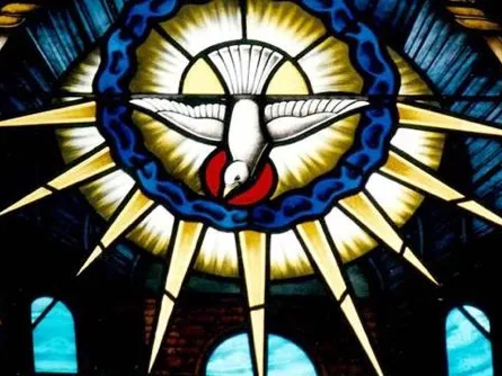

# John 14–16 The Spirit; the Vine 聖靈、葡萄樹
Barry Lee 李萬基 2022.06.24

## 1   Overview 

#### The Holy Spirit 聖靈
- 13:1–17 Jesus **Washes** His Disciples' **Feet** 耶穌為門徒洗腳
- 13:18–30 Jesus Predicts His **Betrayal** 耶穌預言他被背叛
- 13:31–38 Jesus Predicts Peter's Denial 耶穌預言彼得不認主
- 14:1–4 Jesus Comforts His Disciples 耶穌安慰門徒
- 14:5–14 Jesus the Way to the Father 耶穌是通往父神的道路
- 14:15–31 Jesus Promises the **Holy Spirit** 耶穌應許聖靈

#### The Vine 葡萄樹
- 15:1–17 The **Vine** and the Branches 葡萄樹和枝子
- 15:18–25 The World Hates the Disciples 世人恨門徒
- 15:26–16:15 The Work of the **Holy Spirit** 聖靈的工作
- 16:16–33 The Disciples Grief Will Turn to Joy 門徒的憂傷轉為喜樂

#### Questions of the week 本週之謎
- What was Jesus trying to say in 16:8–10, e.g. "about righteousness, because I am going to the Father, where you can see me no longer"? 耶穌在 16:8-10 中想要說什麼，例如 “為義，是因我到父那裏去，你們將不再見到我”？
- What is the hidden meaning behind the Vine? 葡萄樹背後隱藏的意義是什麼？

## 2   The Spirit 聖靈[^1]

### 2.1   _pneuma_ - wind, life breath, spirit 風、生命氣息、靈
- _Pneuma_ is found 24 times in the Fourth Gospel, referring most often to the Spirit of God. _Pneuma_ 在第四福音中出現了 24 次，最常指的是神的靈。
- It is occasionally refers to the human spirit (11:33; 13:21; 19:30)  它偶爾指的是人的靈（11:33; 13:21; 19:30）

### 2.2   _Paracletos_ _-_ the Paraclete

John's Gospel is the only New Testament book that uses this word to describe the Spirit.
約翰福音是唯一用這個詞來描述聖靈的新約書卷。
There are at least four different shades of meaning and hence four translations of the Greek word.
至少有四種不同的含義，因此這希臘詞有四種翻譯。
The first two come from the language of the legal court system of the day:
前兩個來自當時的法律用語：

### 2.3   Legal setting 法律場景

1. Paraclete may mean "one called to the side of another to help." This is one who is called to **assist a client** in a court case. Hence, the translation "Advocate" is used for the Greek word in the New Revised Standard Version and "Counsellor" in the Revised Standard Version. The second meaning is similar. Paraclete 可以說是“一個被召喚到另一個人身邊幫助的人”。 這是在法庭案件中被要求**協助客戶**的人。 因此，NRSV中的希臘詞使用 "Advocate 辯護律師"的翻譯，RSV版中使用“Counsellor 律師 ”一詞，有類似意思。

2. The Paraclete is "one who intercedes, entreats, or makes appeals for another." Again the context is a legal trial. The Paraclete is the **defense attorney**, who speaks on behalf of the defendant. Therefore, the translation "Intercessor" is sometimes found in these passages.  Paraclete 是“為他人「調停」、「求情」的人”，同樣是「 打官司」場景。 Paraclete 是**辯護律師**，代表被告發言。 因此，有時會在這些段落中找到“intercessor調停者”的翻譯。

### 2.4   Non-legal or court meanings 法律場景以外

3. The Paraclete is "one who comforts and consoles another." This meaning is sometimes translated as "Comforter"   Paraclete 是“安慰他人的人”。 這個意思有時被翻譯為“安慰者”
4. A similar Greek word was also used to designate one who "proclaims or exhorts." [In Romans 12:8 a similar word _(paraklesis)_ is translated "exhort."] So the word could also be appropriately translated "Proclaimer." 一個類似的希臘詞也被用來表示“宣揚或勸勉”的人。 [在羅馬書 12:8 中，一個類似的詞 _(paraklesis)_ 被翻譯為“勸勉”。] 所以這個詞也可以適當地翻譯為“宣揚者”。

Also: "Paraclete" was used in some Jewish circles with respect to the functions of the angels. The author seems to have taken this "layered" word and applied it to the Spirit of God; we with _logos._ 另外：“Paraclete”在某些猶太圈子中被用來表示「天使」的功能。 作者似乎把這個多重意義的詞用在了上帝的靈身上；我們與_logos._

Kysar believes that the Fourth Gospel seems to be solving two basic problems with this view of the Paraclete.  Kysar 相信第四福音似乎解決了怎樣看「保惠師」的兩個基本問題。

**1. The delay of the Parousia.** (Barry's note: Parousia means the second coming of Christ. Christians often ask, we're suffering so much. Why has Jesus still not come back yet? But the Spirit helps us endure the suffering we face in this life.)   **Parousia 的延遲。**（Barry註釋：Parousia 意指基督的第二次降臨。基督徒經常問，我們受了這麼多苦，為什麼耶穌還沒有回來？但是聖靈幫助我們忍受我們今生所面對的苦難。）

**2. The problem of historical distance.** (Barry's note: Jesus was a man 2000 years ago. It feels distant. But with the Paraclete, we can learn about Jesus and be transformed into his likeness—whenever and wherever we are in time and space.)  **歷史距離的問題。**（Barry註釋：耶穌是 2000 年前的人，感覺很遙遠。但有了「保惠師」，我們可以了解耶穌，並漸變成他的形象——無論在歷史的任何一點，或地球的任何一處。)

### 2.5   Small group discussion 分組討論

Choose one or two passages 選擇一兩段：

1. What roles are attributed to the Spirit in these passages? 2. What images would you use to describe his activity?  1. 在這些經文中，聖靈扮演什麼角色？ 2. 你會用什麼圖畫來描述他的活動？

- 1:19-34 John the Baptist's testimony 施洗約翰的見證
- 3 the story of Nicodemus 尼哥底母的故事
- 4 the Samaritan woman 撒瑪利亞婦人
- 7:37-39 - the living water 活水 14:1-31-the Paraclete 保惠師
- 16:1-33 - the Paraclete 保惠師
- 20:19-23 - the "Johannine Pentecost” “約翰五旬節”

### 2.6   The nature and function of the Paraclete  保惠師的本質和功能

**The Paraclete comes from and** **is** **related to both** **the** **Father and** **the** **Son:** 保惠師來自「父」和「子」。

a. The Paraclete comes only if Jesus departs 只有當耶穌離開時，保惠師才會出現 (15:26; 16:7, 8,13}.

b. The Paraclete comes from the Father 來自天父 (15:26).

c. The Father gives the Paraclete in response to Jesus' request 天父應耶穌的要求賜下保惠師 (14:16). d. The Paraclete is sent in Jesus' name 保惠師奉「耶穌的名」派來 (14:26).

e. Jesus sends the Paraclete from the Father 耶穌從父那裡差遣保惠師 (15:26)

f. Jesus sends the Paraclete 耶穌差遣保惠師 (16:7).

**The Paraclete** **is** **identified in a number** **of** **different ways:**  Paraclete 用不同的方式表達：

a. Is "another Paraclete' implying that _Jesus is_ _the first_ (14:16). This is consistent with 1 John 2:1 “另一個Paraclete”暗示_耶穌是_ _第一個_（14:16）。這與約翰一書2:1一致：

'My little children, I am writing these things to you so that you may not sin. But if anyone does sin, we have an advocate with the Father, Jesus Christ the righteous.' 我的孩子們哪，我把這些話寫給你們，是要你們不犯罪。若有人犯罪，在父那裏我們有一位中保，就是那義者耶穌基督。

b. Is the "Spirit of truth" 真理的靈(14:17; 15:26; 16:13).

c. Is the "Holy Spirit" 聖靈(14:26).

In **the relationship of the Paraclete to the disciples, the Paraclete:** 保惠師與門徒的關係

a. Is easily recognized by the disciples 很容易被門徒認出 (14:17).

b. Is within and continues to remain with them 在他們裡面並繼續留在他們身邊 (14:16—17).

c. Is their teacher 是他們的老師 (16:13).

d. Announces to the disciples things that are to occur in the future 向門徒宣布將來要發生的事情 (16:13).

e. Declares what belongs to Christ and what does not 宣告什麼屬於基督，什麼不屬於基督 (16:14). 

f. Glorifies Christ 榮耀基督 (16:14).

g. Witnesses to Christ 基督的見證人 (15:26).

h. Reminds the disciples of all that Jesus said 提醒門徒耶穌所說的一切 (14:26).

i. Speaks only what is heard 只說[從父裡]聽到的 (16:13).

**In the relationship of the Paraclete to the world, 保惠師與世界的關係中，the world 世界:**

a. Cannot accept the Paraclete 不能接受保惠師 (14:17).

b. Cannot see or recognize the Paraclete 看不到或認出保惠師 (14:17).

c. Rejects the Paraclete 拒絕保惠師 (15:26).

d. Is condemned, proven wrong, and pronounced guilty of sin by the Paraclete 被保惠師定罪、證明有誤的並宣判有罪 (16:8-11).

According to the Fourth Gospel, the Paraclete has a twofold function 根據第四福音，保惠師有雙重功能:
- To communicate Christ to believers 將基督傳達給信徒。.

- To put the world on trial and find it guilty as charged 把世界送上「法庭」，並根據指控判罪。

### 2.7   Deep dive into 16:8–10 深入研究
16:8–10 When he comes, he will **prove** the world to be in the wrong about sin and righteousness and judgment: about sin, because people do not believe in me; about righteousness, because I am going to the Father, where you can see me no longer; and about judgment, because the prince of this world now stands condemned. 他來的時候，要為罪、為義，為審判，**指證**世人； 為罪，是因他們不信我； 為義，是因我到父那裏去，你們將不再見到我； 為審判，是因這世界的統治者已受了審判。

- **Rhetoric**: "the outlining of headings that would then be expanded was a common rhetorical technique." **修辭**：“由「列出標題」到「內容擴展」是一種常見的修辭技巧。”[^2]
- **Textual Context**: "Jesus sends the Spirit to the disciples (16:7), but through the disciples the Spirit-Paraclete continues Jesus’ ministry to the world (16:8–11)." **文本上下文**：“耶穌將聖靈差遣給門徒（16:7），但透過門徒，聖靈保惠師延續了耶穌對世界的事工（16:8-11）。”[^3]
- **Keyword**: "The verb ἐλέγξει [prove] can simply mean to reprove or to prove, whether by one’s conscience, by the behavior of the righteous, by the Lord, or from other sources." **關鍵詞**：“動詞ἐλέγξει[指證] 可以簡單地表示通過良心道義、義人的行為、「主」或其他來源來譴責或證明。”[^4]
	- "The verb “convict” in the sense of “expose,” or “bring to light” (see 3:20), is particularly appropriate with “sin,”" 「指證」有“揭露”的意義（見 3:20）特別適用於“罪”，[^5]
- **Accuse the accuser**: "Thus part of the Paraclete’s defense of the disciples is to turn the tables, bringing charges against their accusers, just as Jesus usually managed to turn the tables on his accusers in the Fourth Gospel (e.g., 5:16, 45–47; 8:46; 9:39–41)." **控告控告者**：“因此，保惠師為門徒辯護事實上是「 以其人之道還治其人之身」，控告他們的控告者，就像耶穌在第四福音中通常「反轉過來」指控他的控告者一樣（例如，5 :16, 45–47; 8:46; 9:39–41)。”[^6]
	- Satan = the accuser: "_śāṭān_ could simply mean “adversary” in the sense of leader of a faction; however, the term could have the more fundamental sense of a “legal adversary” (i.e., an accuser)" 撒旦 = 原告：“_śāṭān_ 可以是指派系領袖上的“對手”；但是，該術語可能具有“法庭對手”（即原告）的更基本含義[^7]
	- **How Satan defends the world**: "In our world today, this explains why the only thing that seems to be wrong is telling people that they are wrong. This gives unbelievers a false sense of security that there is no judgment or hell awaiting them." **撒旦如何「捍衛」世界**：“這解釋了在現今，告訴人們他們有錯，就似乎是「錯」的行為。這給了非信徒一種虛假的安全感，即沒有審判或地獄等著他們。”
	- **How Satan accuses us**: "Other times, this is done by bringing up past sin that God has forgiven, and we have repented of, to make us relive the worst decisions we have made over and over as a form of torment." **撒旦如何指責我們**：“有時候，他不停「翻舊賬」， 有些罪我們已悔改，上帝也以寬恕，他卻使我們不停重溫過往一些最壞的決定，以折磨我們。[^8]
- **Social context**: "As Jesus proclaims God and refutes his adversaries’ charges in the Fourth Gospel, so the Paraclete equips the Johannine community for witness and apologetic in the setting of conflict." **社會背景**：“正如耶穌在第四福音中宣講上帝並駁斥了他的對手的指控，所以保惠師讓約翰的門徒群體受裝備，以致可以在充滿衝突的環境中作見證和護教。[^9]
- **Overall meaning (Hatch)** : "First, that [the world] has sinned because it has not believed in Christ; second, that believers are justified or acquitted because Christ has gone to the Father to act as their advocate (παράκλητος); and third, that evil has been condemned because the ruler of this world (the devil) has been condemned. The whole context is forensic." **整體含義（Hatch）**：“第一，「世界」犯了罪是因為它不相信基督；第二，信徒被「稱義」或「免罪」，因為基督已經到父那裡去作為他們的辯護人（παράκλητος）；第三，因為這個世界的統治者（魔鬼）被定罪了，所以邪惡被定罪了。整個上下文都是法律用語。[^10]
- **Sin**: "To “convict the world of sin” probably does not mean to bring the world to a conscious recognition of its sin, and consequently to repentance, but simply to expose it before God as sinful. This is what Jesus himself has done (see 9:41; 15:22). “Sin” is defined here, in characteristically Johannine fashion, not as moral failure or the transgression of law, Jewish or otherwise, but simply as rejecting Jesus and his message (see 15:22–24; also 8:24)."**罪**：“指證世人”可能並不是指讓世界意識到自己的罪，從而悔改，而只是在上帝面前將其暴露其罪性。這正是耶穌所做的（見 9:41；15:22）。“罪”在這里(以典型的約翰風格)定義為，不是道德上敗壞或違反法律， 身份是猶太人或其他人，而單是拒絕耶穌和他的信息（見 15:22-24；還有 8:24)。[^11]
- **Righteousness/Justice**: "it seems to mean something more like justification or vindication... Jesus will be “justified,” or vindicated against the world, in his resurrection and ascension."**公義/正義**：“這似乎指「稱義」或「辯白」......耶穌正正將要在他的復活和升天中被「稱義」或 在世人面前顯為「清白」。[^12]
	- two meanings proposed so far — justification for believers (Hatch); for Jesus (Michaels). 迄今學者提出了兩種含義：一為信徒辯白（Hatch）；一為耶穌辯白（Michaels）。
- **Judgment**: "the Advocate will prove the world wrong about “judgment” by proving that “the ruler of this world”—not Jesus—“has been judged" **審判**：“「辯護者」將通過證明「世界統治者」——而不是耶穌——已被審判，來證明世界對「審判」的看法是錯誤的[^13]
	- "From the future perspective of the Advocate, however, Satan’s defeat is an accomplished fact." 然而，從「辯護者」所看未來的角度，撒旦被打敗是一個既成事實。[^14]
- **Overall meaning (Michaels)**: "In short, the Advocate will redefine three familiar terms (familiar especially to the Jews), each one in relation to Jesus: “sin” as rejecting _Jesus,_ “justice” as what God has done for _Jesus,_ and “judgment” as what _Jesus_ carries out by his death." **整體含義（Michaels）**：“簡而言之，「辯護者」將重新定義三個(猶太人熟悉的)術語，而每個都與耶穌有關：「罪」是拒絕耶穌，「義」是上帝為耶穌所做的，和「審判」，正如耶穌通過他的死所執行的[，就是顛覆了世界所認為的審判]。[^15]

## 3   The Vine 葡萄樹

- Read 15:1–8
- John 15:1 I am the true vine, and my Father is the gardener. 我就是真葡萄樹，我父是栽培的人。
- Suggests a vine can be inauthentic. What does John mean? 表明葡萄樹可能是「不真」的。 約翰是什麼意思呢？
	- Hos 何 10:1–2 Israel is a luxuriant vine that yields its fruit. The more his fruit increased, the more altars he built; as his country improved, he improved his pillars. **2**  Their heart is false; now they must bear their guilt. The Lord will break down their altars and destroy their pillars. 以色列是茂盛的葡萄樹， 結果繁多。 果子越多， 就越增添祭壇； 土地越肥美， 就越建造美麗的柱像。2 他們心懷二意， 現今要定為有罪。 耶和華必拆毀他們的祭壇， 粉碎他們的柱像。 
- "The vine image probably alludes to the wine consumed at the **Passover celebration**, having apparently just been consumed in the events of the narrative above." 葡萄樹的形象可能暗示了在**逾越節慶祝活動**中飲用的葡萄酒，尤其剛剛在所記載的[晚餐中]飲過。[^16]
- "John’s Gospel therefore reformulates what it means to be one of ‘the children of Israel’: ‘The real Israel consists of those who receive the revelation of Jesus (1.37, 47) and so Jesus is the ‘king of Israel’ (1.49; 12.13). [] ‘I am the true vine’ (15.1), is part of this polemic to reconfigure Israel [] since the vine was an ancient symbol of Israel." 因此，約翰福音重新表述了成為「以色列兒女」的含義：“真以色列包括那些接受耶穌啟示的人 (1.37, 47)，和耶穌是「以色列的王」 (1.49; 12.13) ）。 []「我是真葡萄樹」（15.1）， [也以類似方式]重新表達以色列的身份[]，因為葡萄樹是以色列自古以來的象徵。[^17]

### 3.1   Vine as a corporate concept 葡萄樹作為群體象徵
#### Pre-exilic 以色列人被擄之前
- Joseph was a fruitful vine (Gen 49:22): "Joseph is a fruitful vine, a fruitful vine near a spring, whose branches climb over a wall. 約瑟是多結果子的樹枝， 是泉旁多結果的枝子； 他的枝條伸出牆外。"
- Vine of Sodom – negative (Deut 32:32): "Their vine comes from the vine of Sodom and from the fields of Gomorrah. Their grapes are filled with poison, and their clusters with bitterness. 他們的葡萄樹是所多瑪的葡萄樹， 是蛾摩拉田園所長的； 他們的葡萄是毒葡萄， 整串都是苦的。"
- Jer 耶 2:21 I had planted you like a choice vine of sound and reliable stock. How then did you turn against me into a **corrupt, wild vine**? 然而，我栽種你為上等的葡萄樹， 全用純正的種子； 你怎麼向我變為外邦葡萄樹的**壞枝子**呢？

#### Post-exilic 以色列人被擄之後
- Eze 結 15:1-5 The word of the Lord came to me: “Son of man, how is the wood of a vine different from that of a branch from any of the trees in the forest? Is wood ever taken from it to make anything useful? Do they make pegs from it to hang things on? And after it is thrown on the fire as fuel and the fire burns both ends and chars the middle, is it then useful for anything? If it was not useful for anything when it was whole, how much less can it be made into something useful when the fire has burned it and it is charred? 耶和華的話臨到我，說： 「人子啊，葡萄樹比一切其他的樹，就是樹林裏眾樹木的樹枝，有甚麼長處呢？ 可以從其中取木料來做工嗎？人可以拿來做釘子，掛東西在上面嗎？ 看哪，它已經拋在火中當柴燒，火既燒了兩頭，中間也燒焦了，它還有甚麼用處呢？ 看哪，它完整的時候尚且不能拿來做工，何況被火燒焦了，還能拿來做工嗎？
- Ps 詩 80:8–16 You transplanted a vine from Egypt; you drove out the nations and planted it... 12 Why have you broken down its walls so that all who pass by pick its grapes?... 14 Return to us, God Almighty! Look down from heaven and see! Watch over this vine, the root your right hand has planted, the son you have raised up for yourself. Your vine is cut down, it is burned with fire; at your rebuke your people perish. 你從埃及拔出一棵葡萄樹， 趕出外邦人，把這樹栽上... 你為何拆毀這樹的籬笆， 任憑路人摘取？... 萬軍之上帝啊，求你轉回， 從天上垂看觀察，眷顧這葡萄樹； 保護你右手所栽的根， 你為自己所堅固的幼苗。 這樹已經被火焚燒，被刀砍伐， 因你臉上的怒容就滅亡了。
- Warning: God has done the pruning and burning on Israel the Vine in the past. He can do it again. 警告：上帝在過去已經對以色列這棵葡萄樹修剪和燒毀過。 他可以同樣為真葡萄樹再做一次。

#### Second Temple Period 第二聖殿時期
- Large golden vine at the entrance to the Herodian temple Ant. 15.395. Image used by later Judaism. 希律所見的聖殿入口處有金造的巨大葡萄藤，後來成為猶太教的象徵。

### 3.2   Meanings in John 15 約翰福音 15 章的含義
1. The true vine is Jesus 真葡萄樹就是耶穌 (15:1).
2. The branches cannot survive without the vine 沒有葡萄樹，枝子就無法生存 (15:5).
3. The Gardener will ensure the vine produces fruit by pruning and discarding branches that are not productive 「園主」會透過修剪和丟棄不結果的枝子來確保葡萄樹結果子 (15:2, 6); judgment and discipleship picture. 這裏有審判和門徒訓練的影子。
4. The branches are cleansed “by the word” (15:3) – not ritual purity.  The means by which cleansing happens has changed. 枝子被“道”（15:3）所潔淨——而不是靠守禮儀。淨化的方式[從舊約聖經至今]發生了變化。

### 3.3   "I Am" statements: *egō eimi* 「我是」 宣言

“I am the bread of life” (Jn 6:35, 48) (cf. Jn 6:41, 51:
我就是生命的糧
“I am the [living] bread who descends from heaven”)
我是從天上降下來的糧
“I am the light of the world” (Jn 8:12) (cf. Jn 9:5)
我就是世界的光
“I am the door (for the sheep)” (Jn 10:7, 9)
我就是羊的門
“I am the good shepherd” (Jn 10:11, 14)
我是好牧人
“I am the resurrection and the life” (Jn 11:25)
復活在我，生命也在我 （原文：我就是復活和生命）
“I am the way, the truth and the life” (Jn 14:6)
我就是道路、真理、生命
“I am the true vine (Jn 15:1, 5)[^18]
我就是真葡萄樹

## 4   Conclusion 總結
- The Holy Spirit is more than the Comforter—he is the Defense Attorney for us. 聖靈不僅僅是保惠師——他是我們的辯護者。
- "the question for God’s people is no longer, “Do I live in the vineyard?” but instead, “Am I attached to Jesus, the vine?”"對上帝子民的問題不再是‘我住在葡萄園裡嗎？ 取而代之的是，“我是否仍連結於耶穌這葡萄樹？”[^19]
	- One should be able to look at a branch, see its fruit, and say, “This branch is living, it is attached, it is vital and growing from the vine.” 一個人應該能夠看著一根樹枝，看到它的果子，然後說：“這根樹枝是活的，它是附著的，它是有生命力的，並且是從葡萄樹上長出來的。[^20]
- "[The analogy of the Vine] means that Christianity is not simply about believing the right things (though this is important). Nor is it simply a matter of living a Christ-like life (though this is important too). [葡萄樹的比喻]意味著基督教不僅僅是相信正確的事情（儘管這很重要）。 也不僅僅是過像基督一樣的生活（儘管這也很重要）。
- Christian experience must necessarily have a mystical, spiritual, non-quantifiable dimension. To be a disciple means having the Father, Son, and Holy Spirit living in us (14:23–26). It means having a supernatural, interior experience that is completely unlike anything available in the world. 基督徒的經歷必然有一個神秘的、屬靈的、不可量化的維度。成為門徒意味著有父、子和聖靈住在我們裡面（14:23-26）。 這意味著擁有一種完全不同於世界上任何東西的超自然的「內在生命」。
- It is a way of believing (doctrine) and a way of living (ethics), but these are nurtured by the life-giving connection with Jesus Christ."   這是一種「信仰方式」（教義）和一種「生活方式」（倫理學），但這些都是由與耶穌基督那種活化生命的結連所孕育出來的。[^21]

#### Easter egg 彩蛋！

Did Jesus give us a FREE promise on anything we ask?? 耶穌會不會對我們祈求的任何事情都必然答應呢？

15:7 If you remain in me and my words remain in you, ask whatever you wish, and it will be done for you. 你們若常在我裏面，我的話也常在你們裏面，凡你們想要的，祈求，就給你們成全。

"The promise is in effect only on the stated condition that “you make your dwelling in me, and my words come to dwell in you.” If answered prayer is not itself the “fruit” of which Jesus speaks, it is at least the means—perhaps the only means—by which the expectation of “much fruit” is to be fulfilled." 「應許」只有在「你們若常在我裏面，我的話也常在你們裏面」的規定條件下才有效。如果「祈禱被應允」本身不是耶穌所說的「果子」，那麼它至少是期待可實現「多結果子」的方法——也許是唯一的方法。[^22]

[^1]: Developed from Dr Sarah Harris's lecture on the Gospel of John, Carey Baptist College, 2022.
[^2]: Craig S. Keener, [_The Gospel of John: A Commentary & 2_](https://ref.ly/logosres/gspljhncmm2vls?ref=Bible.Jn16.8-11&off=864&ctx=charges+in+16:9%E2%80%9311%3b+~the+outlining+of+hea), vol. 1 (Grand Rapids, MI: Baker Academic, 2012), 1030.
[^3]: Craig S. Keener, [_The Gospel of John: A Commentary & 2_](https://ref.ly/logosres/gspljhncmm2vls?ref=Bible.Jn16.8-11&off=149&ctx=gh+the+disciples.10+~Jesus+sends+the+Spir), vol. 1 (Grand Rapids, MI: Baker Academic, 2012), 1030.
[^4]: Craig S. Keener, [_The Gospel of John: A Commentary & 2_](https://ref.ly/logosres/gspljhncmm2vls?ref=Bible.Jn16.8-11&off=980&ctx=osecuting+the+World%0a~The+verb+%CE%B5%CC%93%CE%BB%CE%B5%CC%81%CE%B3%CE%BE%CE%B5%CE%B9+c), vol. 1 (Grand Rapids, MI: Baker Academic, 2012), 1030.
[^5]: J. Ramsey Michaels, [_The Gospel of John_](https://ref.ly/logosres/nicnt64jn3?ref=Bible.Jn16.8-11&off=779&ctx=e+world+of%EF%BB%BF81+sin.%E2%80%9D+~The+verb+%E2%80%9Cconvict%E2%80%9D+i), The New International Commentary on the Old and New Testament (Grand Rapids, MI; Cambridge, UK: William B. Eerdmans Publishing Company, 2010), 833.
[^6]: Craig S. Keener, [_The Gospel of John: A Commentary & 2_](https://ref.ly/logosres/gspljhncmm2vls?ref=Bible.Jn16.8-11&off=2239&ctx=ainst+the+world.%E2%80%9D28%0a~Thus+part+of+the+Par), vol. 1 (Grand Rapids, MI: Baker Academic, 2012), 1031.
[^7]: R. H. Bell, [“Demon, Devil, Satan,”](https://ref.ly/logosres/dctjssgsscnddtn?ref=Page.p+193&off=2787&ctx=n+1+Kings+11:23%2c+25+~s%CC%81a%CC%84%E1%B9%ADa%CC%84n+could+simpl) ed. Joel B. Green, Jeannine K. Brown, and Nicholas Perrin, _Dictionary of Jesus and the Gospels, Second Edition_ (Downers Grove, IL; Nottingham, England: IVP Academic; IVP, 2013), 193.
[^8]: Mark Driscoll, "Can You Name the 2 Ways Satan Condemns?", https://realfaith.com/daily-devotions/can-you-name-the-2-ways-satan-condemns/
[^9]: Craig S. Keener, [_The Gospel of John: A Commentary & 2_](https://ref.ly/logosres/gspljhncmm2vls?ref=Bible.Jn16.8-11&off=2967&ctx=would+have+no+case.)~+As+Jesus+proclaims+), vol. 1 (Grand Rapids, MI: Baker Academic, 2012), 1032.
[^10]: W. H. P. Hatch, “The Meaning of John XVI,8–11.” _HTR_ 14 (1921): 103–5, 105.
[^11]: J. Ramsey Michaels, [_The Gospel of John_](https://ref.ly/logosres/nicnt64jn3?ref=Bible.Jn16.8-11&off=969&ctx=cts+me+of+sin%3f%E2%80%9D).82+~To+%E2%80%9Cconvict+the+worl), The New International Commentary on the Old and New Testament (Grand Rapids, MI; Cambridge, UK: William B. Eerdmans Publishing Company, 2010), 833.
[^12]: J. Ramsey Michaels, [_The Gospel of John_](https://ref.ly/logosres/nicnt64jn3?ref=Bible.Jn16.8-11&off=3025&ctx=+Testament+writers%2c+~Jesus+will+be+%E2%80%9Cjusti), The New International Commentary on the Old and New Testament (Grand Rapids, MI; Cambridge, UK: William B. Eerdmans Publishing Company, 2010), 834.
[^13]: J. Ramsey Michaels, [_The Gospel of John_](https://ref.ly/logosres/nicnt64jn3?ref=Bible.Jn16.8-11&off=3501&ctx=Here+he+claims+that+~the+Advocate+will+pr), The New International Commentary on the Old and New Testament (Grand Rapids, MI; Cambridge, UK: William B. Eerdmans Publishing Company, 2010), 835.
[^14]: J. Ramsey Michaels, [_The Gospel of John_](https://ref.ly/logosres/nicnt64jn3?ref=Bible.Jn16.8-11&off=4056&ctx=s+nothing%E2%80%9D+(14:30).+~From+the+future+pers), The New International Commentary on the Old and New Testament (Grand Rapids, MI; Cambridge, UK: William B. Eerdmans Publishing Company, 2010), 835.
[^15]: J. Ramsey Michaels, [_The Gospel of John_](https://ref.ly/logosres/nicnt64jn3?ref=Bible.Jn16.8-11&off=4505&ctx=ng+of+the+Advocate.+~In+short%2c+the+Advoca), The New International Commentary on the Old and New Testament (Grand Rapids, MI; Cambridge, UK: William B. Eerdmans Publishing Company, 2010), 835.
[^16]: Stanley E. Porter, _John, His Gospel,_ _and_ _Jesus: In Pursuit_ _of_ _the_ _Johannine Jesus_ (Grand Rapids: Eerdmans, 2015), 219.
[^17]: Mary L. Coloe, "Gentiles in the Gospel of John: Narrative Possibilities - John 12:12-43," in _Attitudes to_ _Gentiles in_ _Ancient_ _Judaism and Early Christianity,_ eds. David C, Sim and James S. McLaren, LNTS 499 (London: T&T Clark, 2013), 209-223, 222.
[^18]: C. H. Williams, [“‘I Am’ Sayings,”](https://ref.ly/logosres/dctjssgsscnddtn?ref=Page.p+397&off=45&ctx=e+image+or+concept.%0a~%E2%80%9CI+am+the+bread+of+l) ed. Joel B. Green, Jeannine K. Brown, and Nicholas Perrin, _Dictionary of Jesus and the Gospels, Second Edition_ (Downers Grove, IL; Nottingham, England: IVP Academic; IVP, 2013), 397.
[^19]: Gary M. Burge, [_John_](https://ref.ly/logosres/nivac64jn?ref=Bible.Jn15.1-16.4a&off=28593&ctx=ts+of+one+vine%2c+and+~the+question+for+God), The NIV Application Commentary (Grand Rapids, MI: Zondervan Publishing House, 2000), 425.
[^20]: Gary M. Burge, [_John_](https://ref.ly/logosres/nivac64jn?ref=Bible.Jn15.1-16.4a&off=31314&ctx=%2c+means+everything.+~One+should+be+able+t), The NIV Application Commentary (Grand Rapids, MI: Zondervan Publishing House, 2000), 426.
[^21]: Gary M. Burge, [_John_](https://ref.ly/logosres/nivac64jn?ref=Bible.Jn15.1-16.4a&off=31458&ctx=ing+from+the+vine.%E2%80%9D%0a~This+means+that+Chri), The NIV Application Commentary (Grand Rapids, MI: Zondervan Publishing House, 2000), 426.
[^22]: J. Ramsey Michaels, [_The Gospel of John_](https://ref.ly/logosres/nicnt64jn3?ref=Bible.Jn15.7&off=1382&ctx=+than+before%2c40+but+~the+promise+is+in+ef), The New International Commentary on the Old and New Testament (Grand Rapids, MI; Cambridge, UK: William B. Eerdmans Publishing Company, 2010), 808.
[^23]: Stanley E. Porter, _John, His Gospel,_ _and_ _Jesus: In Pursuit_ _of_ _the_ _Johannine Jesus_ (Grand Rapids: Eerdmans, 2015), 219.
