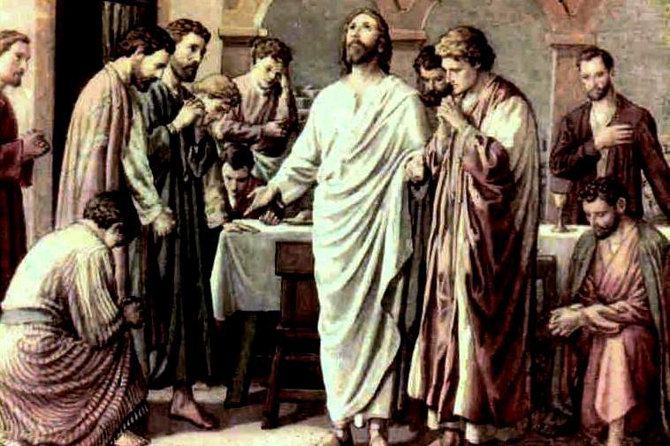
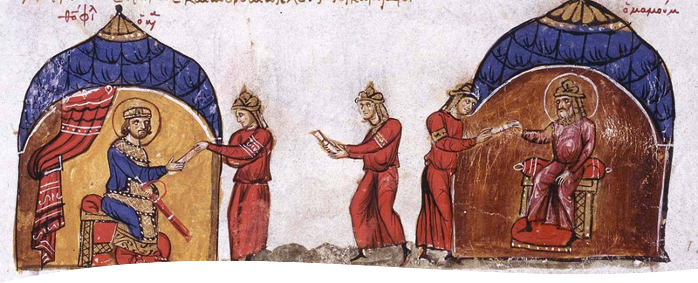

# Jesus' Prayer for Disciples 為門徒祈禱
Barry Lee 李萬基 2022.07.03

- “Lifting up” one’s “eyes” was a common posture of prayer (11:41; cf. Mark 6:41; 7:34) in early Judaism (1 Esd 4:58; 4 Macc 6:6, 26) and appeared among Gentiles." 「舉目望天」是早期猶太教（1 Esd 4:58；4 Macc 6:6, 26）中常見的祈禱姿勢（11:41；參見馬可福音 6:41；7:34）並也在外邦人中常見。”[^1]
- 17:1–5 Jesus Prays to Be Gloried 耶穌祈求得榮耀
- 17:6–19 Jesus Prays for His Disciples 耶穌為門徒祈禱
- 17:20–26 Jesus Prays for All Believers 耶穌為所有信徒祈禱

## Oneness in Chapter 17 第17章所描述的合一

17:11 I will remain in the world no longer, but they are still in the world, and I am coming to you. Holy Father, protect them by the power of your name, the name you gave me, so that **they may be one as we are one**. 我到你那裏去；我不再留在世上，他們卻在世上。聖父啊，求你因你的名，就是你所賜給我的名，保守他們，使**他們像我們一樣合而為一**。 

17:20–22 “My prayer is not for them alone. I pray also for those who will believe in me through their message, that **all of them may be one**, Father, just **as you are in me and I am in you**. May they also be in us so that the world may believe that you have sent me. I have given them the glory that you gave me, that **they may be one as we are one**—This happened so that the words he had spoken would be fulfilled: “I have not lost one of those you gave me.” 我不但為這些人祈求，也為那些藉著他們的話信我的人祈求， 21 使他們都合而為一。正如父你在我裏面，我在你裏面，使他們也在我們裏面，好讓世人信是你差我來的。 22 你所賜給我的榮耀，我已賜給他們，使他們合而為一，像我們合而為一。

## Oneness between the Father and the Son 父與子的合一

- The most point-blank depiction of such is when Jesus claims that “I and the Father are one” 最直接的描述就是當耶穌聲稱“我與父原為一" (10:30) 
- The oneness is given further meaning in 17:21 by Jesus’s prayer: “they may all be one, just as you, Father, are in me, and I in you” (ESV). Here the oneness extends from Father and Son to believers and is exemplified by the “mutual indwelling of Father and Son” 耶穌的禱告在 17 章 21 節中進一步定義了「一體性」：“使他們都合而為一。正如父你在我裏面，我在你裏面”。 這裡的一體性從父子延伸到信徒，以“父子相互內住”為例證 [^2]
- The oneness of Father and Son should also be seen in the light of their (lack of) distinctiveness. Walter understands this “christological oneness” in terms of that “the Father and Son are distinct even within their unity”. 父子的一體性也應該從他們（非）獨特性的角度來看。 Walter將這種“一體性”理解為: “父與子即使在他們的合一中也是不同的”。[^3]
- He further asserts that John does not delineate clearly the interrelationship between the Father and the Son, but they are so “united” that they demonstrate the “prototype of true solidarity”. 他進一步斷言，約翰沒有清楚地描繪父與子之間的相互關係，但他們是如此“團結”，以至於他們展示了“真正團結的典範”。[^4]
- Keener observes that in 17:3, the connection between Jesus and the Father is so close that it is even grammatically feasible to read “the only true God, and Jesus Christ” as a hendiadys, equating Jesus as God, or ‘God–Jesus’. Keener觀察到，在 17 章 3 節中，耶穌和天父之間的聯繫是如此密切，甚至在語法上甚至可以將“唯一的真神和耶穌基督”解讀為一個 hendiadys，將耶穌等同於上帝，或“上帝-耶穌” '。[^5]
- On the other hand, Thompson notes how John “consistently distinguishes” the Father and the Son even when their unity is foregrounded (cf. 10:28–30; 17:11, 21). 另一方面，Thompson注意到約翰如何“始終如一地區分”父與子，即使它們的統一性被強調（參見 10:28-30；17:11, 21）。[^6]
	- 10:28 I give them eternal life, and they shall never perish; no one will snatch them out of **my hand**. 29 My Father, who has given them to me, is greater than all; no one can snatch them out of **my Father’s hand**. 30 I and the Father are one. 並且，我賜給他們永生；他們永不滅亡，誰也不能從我手裏把他們奪去。 我父所賜給我的比萬有都大，誰也不能從我父手裏把他們奪去。 我與父原為一。」
- Likewise, in commenting 1:14 and 18, Michaels invokes the Hellenistic notions of “nature” and of “person” to explain how Christian theology understands the Father and the Son being “two distinct persons” but “sharing a common nature as God 同樣，在評論 1:14 和 18 時，邁克爾斯援引希臘化的「本質」和「位格」(person) 概念來解釋基督教神學如何理解父和子是“兩個不同的位格”，但“作為上帝具有共同的本質” .
- The oneness also reflects a reciprocal and dynamic relationship. Ramelli sees the oneness between Father and Son (cf. 10:38, 14:10 and 17:21) as a “dynamic unity”. 一體性也反映了一種「互惠」和「動態」的關係。 拉梅利將父與子之間的統一（參見 10:38、14:10 和 17:21）視為「動態合一」。[^7]
- He regards ‘the Father in the Son and the Son in the Father’ as a notion of “reciprocal indwelling”. He further underpinned the concept of “dynamic unity” by the notion of “reciprocal knowledge” between Father and Son, based on 10:15: “just as the Father knows me and I know the Father”. 他認為“父在子中，子在父中”是「相互內住」的概念。 他基於 10:15 進一步通過父與子之間的「知識互通」的概念來支持「動態聯合」的概念：“正如父認識我，我也認識父一樣”。[^8]

## The uniqueness of Jesus’s sonship 耶穌作為兒子的獨特性

- John uses the word μονογενής (monogenēs) to
describe Jesus’s unique sonship in 1:14, 3:16 and 3:18. Both
Köstenberger and Loader share a similar understanding of the word as “one of a kind”[^9] or “the only one of his kind” respectively.[^10] 約翰使用詞 μονογενής (monogenēs)
在 1:14、3:16 和 3:18 中描述耶穌獨特的兒子身份。 Köstenberger 和 Loader 對這個詞的理解相似，分別為「 獨一類別」或「同類中的獨一」。
- Keener adds another layer of meaning to μονογενής.
The word, often translated into “the only begotten (Son)” in older renditions such as KJV and NASB (cf. 3:16), does not necessarily mean “the sense of derivation” but “the special object of divine love”. Keener 為 μονογενής 添加了另一層含義。這個詞在 KJV 和 NASB（參見 3:16）等較舊的版本中經常被翻譯成“獨生子”，並不一定意味著「被生出來的意義」，而是「被神聖的愛所寵愛的特別一位」。[^11]
- From John’s prologue (1:1–18), Winn sees Jesus’s divine
sonship predicated upon the “preexistent and metaphysical relationship” between the Father and the Son. 從約翰的序言（1:1-18），Winn認為耶穌聖子身份是建基於和聖父「 從亙古以先」和「 超越物質宇宙」的關係上。
- Jesus was clearly cognizant of his preexistence, especially when he proclaimed “before Abraham was born, I am” (8:58) and also when he prayed “Father, glorify me in your presence with the glory I had with you before the world began” (17:5). 耶穌清楚地認識到他「 從亙古以先」的存在，特別是當他宣布「還沒有亞伯拉罕我就存在了」（8:58）時，以及當他祈禱「父啊，現在求你使我在你面前得榮耀，就是在未有世界以前，我同你享有的榮耀」（17:5）。
- This monogenēs reading of Jesus’s sonship underlines that he is the Son *par excellence*. 以「 獨一類別」來理解 耶穌的聖子身份強調了他是那一位「出類拔萃」的兒子。
- In the Old Testament, ‘sons of God’ can refer to angelic beings (cf. Ps 2:7 and 89:5–6) or human kings (cf. 1 Chr 17:13; 22:10; 28:6). 在舊約中，“上帝的兒子”可以指天使（參見詩 2:7 和 89:5-6）或人類君王（參見歷上 17:13；22:10；28:6）。
- For example, the Prophet Nathan told David about his successors and kings after him: “I will be his father, and he will be my son” (1 Chr 17:13). 例如，先知拿單告訴大衛他的繼任者和國王：“我要作他的父，他要作我的子”（1 Chr 17:13）。...
- His preexistence (8:58; 17:5) indicates that he is the *uncreated*, thus set apart from other created beings. 他「 從亙古以先」的存在（8:58；17:5）表明他是那位*非受造的*，因此與其他受造物分開。
- In 20:17, Jesus told his disciples, “I am ascending to *my* Father and *your* Father, to *my* God and *your* God” (emphasis mine), telling apart how his sonship is unique and incommensurable to other forms of ‘sonship’. 在 20:17 中，耶穌告訴他的門徒：「我要升上去見我的父，也是你們的父，見我的上帝，也是你們的上帝。」”，說明他的兒子身份是多麼獨特和其他“兒子身份”完全不能比較。[^12]

## The familial imagery 家庭的意象

- In Jewish and other Christian scriptures, God is commonly portrayed as the Father. 在猶太教和其他基督教經文中，上帝通常被描繪為「父」。[^13]
- John refers to God as the Father approximately 118 times in the Gospel, mainly during the discourse between Jesus and his interlocutors. 約翰在福音書中大約 118 次將上帝稱為父，主要是在耶穌和他的對話者之間的談話中。[^14]
- In 8:35, Jesus paints an image of a large household and establishes his place as the unique son within the family of God: “The slave does not have a permanent place in the household; the son has a place there forever”. 在 8 章 35 節，耶穌描繪了一個大家庭的形象，並確立了他在上帝家中獨一兒子的地位： 「奴隸不能永遠住在家裏；兒子才永遠住在家裏。」[^15]
- Thompson sees the language of “Son of God” and “Son” denoting a “distinctly filial relationship”, as Jesus shares the Father’s glory (12:23; 13:31; 14:13; 17:1) and undertakes the Father’s mission (3:16–17; 5:21, 25–26; 6:40). 湯普森看“上帝的兒子”和“兒子”的描述表現了「明顯的孝道關係」，因為耶穌分享了天父的榮耀（12:23；13:31；14:13；17:1）並承擔了天父的使命 （3:16-17；5:21、25-26；6:40）。[^16]
- Moreover, in 8:38–39, Jesus alludes to the fact that it is expected that a son would imitate the father’s action: “you are doing what you have heard from your father”. 此外，在 8 章 38 至 39 節中，耶穌暗示了一件事，就是兒子會模仿父親的行為：「我所說的是在我父那裏看見的；你們所做的是在你們的父那裏聽到的。」
- Like father, like son
- Loader pushes the emulation idea further to highlight the element of ‘apprenticeship’ within a familial setting. Loader 把「子模仿父」的想法延伸，以突出家庭環境中的「學徒」元素。[^17]
- In 5:20, Jesus says, “the Father loves the Son and shows him all he does… and… even greater works than these”, alluding to a ‘working’ relationship. It is not uncommon in an ancient society for the son to pick up the same trade or career the father does in a familial setting. 在 5:20 中，耶穌說，“父愛子，將自己所做的一切事指示給他看，還要將比這更大的事給他看”，暗指“工作”的關係。 在古代社會中，兒子從事與父親在家庭環境中從事的相同行業或職業的情況並不少見。
- Loader also observes that the present tense in 5:20 implies “ongoing instruction and information”,[^18] highlighting an uninterrupted apprenticeship. Loader 還觀察到 5:20 中的「現在式」表示「持續的指導和信息傳遞」，突出了一種「不間斷」的學徒身份。
- I argue that the ‘apprenticeship’ idea was ultimately manifested in the resurrection of Lazarus. In 5:21, Jesus depicts a parallel of miraculous work: “as the Father raises the dead and gives them life, so also the Son gives life to whom he will”, foreshadowing what he would do later in Chapter 11 for Lazarus. 我認為“學徒身份”最終體現在拉撒路的復活中。 在 5 章 21 節中，耶穌描述了神蹟的工作：“父怎樣叫死人復活，賜他們生命，子也照樣隨自己的意願賜人生命”，這預示了他稍後會在第 11 章為拉撒路所做的事。

## The envoy imagery 使節的意象

- The theme of ‘sending’ runs through the Gospel and is “central to Johannine faith” since the Son is sent by the Father to accomplish the salvific mission and then return. “差遣”的主題貫穿福音，是“約翰信仰的核心”，因為聖子被聖父派遣完成救恩使命，然後返回。[^19]
- Jesus is being “entrusted” to fully carry out the Father’s work and words (5:19–22, 26–27; 17:6–8, 10). 耶穌被“託付”去完成天父的工作和話語（5:19-22, 26-27; 17:6-8, 10）。[^20]
	- 17:7–8 Now they know that everything you have given me comes from you. For I gave them the words you gave me and they accepted them. They knew with certainty that I came from you, and they believed that you sent me. 現在他們知道，你所賜給我的一切都是從你那裏來的； 8 因為你所賜給我的話，我已經賜給他們，他們也領受了，又確實知道，我是從你出來的，並且信你差了我來。
- Anderson draws a parallel between Jesus’s being sent with Moses’s being sent (Deut 18:15–22)—the latter serving as a typology for Jesus’s mission. 安德森將耶穌被派遣與摩西被派遣（申 18:15-22）進行了類比——後者作為耶穌使命的預表。[^21]
- This thought has much credence, given the frequent parallel between Jesus and Moses in the first half of the Gospel (Jn 1:17, 1:45, 3:14, 5:45–46, 6:32, 9:29). 鑑於耶穌和摩西在福音的前半部分經常出現相似之處（約翰福音 1:17, 1:45, 3:14, 5:45-46, 6:32, 9:29），這個想法非常可信。
- The Johannine Father-sending-Son relationship reveals how the christocentric purpose of the Father and the theocentric mission of the Son intermingle,\[34\] underlining a special ‘one-of-a-kind’ envoy. 約翰的「父-差-子」關係揭示了父的「以基督為中心的目的」和子「以神為中心的使命」是如何混合的，強調了這位是“獨一無二”的特使。[^22]
- However, Jesus is more than an envoy from God. In 5:30, Jesus reveals his ongoing relationship with the Father as someone commissioned to judge: “As I hear, I judge… I do not seek my own will, but the will of him who sent me”. 然而，耶穌不僅僅是上帝的使者。 在 5:30，耶穌揭示了他與天父無間斷的連係，和作為受託審判的人：「我怎麼聽見就怎麼審判，而我的審判是公平的，因為我不尋求自己的意願，只尋求差我來那位的旨意。」。
- Loader conjures the mutual indwelling imagery in 10:36–39 and contends that John’s depiction “goes beyond the envoy model” and that Jesus is “not an unconscious mouthpiece of the Father”. Loader在 10:36-39 中提及了「相互內住」的意象，並說約翰的描述「超出了差使的角色」，並且耶穌「不是無意識的天父代言人」。
- The “I am” statements scattered throughout the Gospel also expand the envoy idea: the Son is not just “sent with a commission, but as in himself bearing… divine qualities”. 散佈在福音書中的“我是”陳述也打破單純是差使的想法：聖子不僅“被派來受委託，而且在他自己身上具有……（全然）神聖的本質”。[^23]

## The love and intimacy imagery 愛與親密的意象

- The most vivid imagery conveying intimacy between the Father and the Son perhaps belongs to 1:18: “It is God the only Son, who is close to the Father’s heart” (NRSV). 傳達父與子之間親密關係的最生動形象可能屬於 1:18：“他是上帝獨一的兒子，他與父的心很親近”（NRSV）。
	- 1:18 No one has ever seen God, but the one and only Son, who is himself God and f is in closest relationship with the Father, has made him known. 從來沒有人見過上帝，只有在父懷裏獨一的兒子將他表明出來。 
- The original Greek means “in the bosom of the father”. 原文的希臘語意思是“在父親的懷裡”。
- Unsurprisingly, Jesus later turns his love into zealousness to sanctify the Father’s house (2:18–20).[^24] The love portrayed is reciprocal. 不意外的是，耶穌後來將他的愛轉化為熱心， 潔淨聖殿(我父的殿)（2:18-20）。所描繪的愛是相互的。
- The love between God and Jesus is articulated multiple times within the Gospel of John, with a different nuance each time. 上帝和耶穌之間的愛在約翰福音中多次表達，每次都有不同的細微差別。
- In 3:35, how the Father loves the Son is explained by the *unlimited authority* given to Jesus: “The Father loves the Son and has placed everything in his hands.”. 在 3:35 中，「父如何愛子」通過「賦予耶穌無限的權柄」來解釋：“父愛子，已把萬有交在他手裏”。
- In 5:20, the love is demonstrated by an _unqualified revelation_ from God: “For the Father loves the Son and shows him all he does.” 在 5 章 20 節，上帝的「無條件啟示」表明了愛：“父愛子，將自己所做的一切事指示給他看”。
- In 10:17, Jesus explains that the reason the Father loves him is his unreserved obedience to lay down his life. Later this love is expanded to include the disciples and believers in general (15:9, 16:26–28, 17:22–23). 在 10 章 17 節，耶穌解釋說，天父愛他的原因是他毫無保留地順服了自己的生命。 後來這種愛擴大到包括門徒和一般信徒（15:9, 16:26-28, 17:22-23）。
- mutual indwelling「相互內住」

## An implication for today’s church 對今日教會的意義

- The intimate relationship signified by mutual indwelling between the Father and the Son is meant to be expanded to the disciples and the whole believing community. 父子之間相互內住所表示的親密關係，意在擴大到門徒和整個信徒群體。
- Ramelli calls this the “expansive notion of dynamic unity”. Ramelli 將此稱為“擴大的動態合一”。[^25]
- The idea is first predicated on the reciprocal indwelling within the Godhead: the Father is in the Son and the Son in the Father (14:10, 17:21). A similar indwelling is then inferred for believers that “they also may be in us” (17:21b). 這個想法首先是基於在神格內的「相互內住」：父在子裡面，子在父裡面（14:10, 17:21）。 然後向信徒延伸出類似的內住，“使他們也在我們裏面”（17:21b）。
- As Keener put it, the linchpin for this grand unity is  Jesus himself: “Disciples’ intimacy with the Father is mediated through Jesus (14:6), but because of their immediacy with Jesus, they also have immediate contact with the Father (16:26–27).” 正如基納所說，這個大團結的關鍵是耶穌本人：“門徒與天父的親密關係是通過耶穌作中介的（14:6），但由於他們與耶穌的直接關係，他們也與天父直接接觸（16:26-27）。”[^26]
- The awareness of the oneness of believers within the oneness of Father and Son can subvert the individualistic and chauvinistic ethos prevalent in 21st-century churches 在父子合一中對信徒合一的認識可以顛覆 21 世紀教會中普遍存在的「個人主義」和「本族至上主義」。
- Knowing all believers are one, we can bolster our effort to embrace Christians different from our theological position, political adherence and cultural norm, especially those within our own church. 知道所有的信徒都是一體的，我們可以加倍努力去接納與我們的神學立場、政治取向和文化常規不同的基督徒，尤其是我們自身教會中的基督徒。
- Thanks to Jesus’s oneness with the Father, we are as close to the Father’s bosom as those who are poles apart from us. 感謝耶穌與天父的合一，我們安穩在天父的胸懷，就像那些與我們南轅北轍的人都在天父的胸懷一樣。

## Group discussion 分組討論
- 有什麼神學立場、政治取向和文化常規和我們不同的基督徒讓我們很難去接納的呢？Who are the Christians from theological position, political adherence and cultural norm different than us that we'd find hard to accept?
- 在父與子合一的亮光中，我們該怎樣面對他們呢？In light of the oneness of the Father and the Son, how shall we face them?

[^1]: Craig S. Keener, [_The Gospel of John: A Commentary & 2_](https://ref.ly/logosres/gspljhncmm2vls?ref=Bible.Jn17.1-26&off=4533&ctx=+in+Jesus%E2%80%99+posture.+~%E2%80%9CLifting+up%E2%80%9D+one%E2%80%99s+%E2%80%9C), vol. 1 (Grand Rapids, MI: Baker Academic, 2012), 1052.
[^2]: William Loader, *Jesus in Johns Gospel: Structure and Issues in Johannine Christology* (Grand Rapids, MI: Eerdmans Publishing, 2017), 343.
[^3]: Walter F. Jr. Taylor, “Unity/Unity of Humanity,” AYBD, 749–53, 752.
[^4]: Walter, “Unity/Unity of Humanity,” 752.
[^5]: Craig S. Keener, *The Gospel of John: A Commentary*, vol. 1 (Grand Rapids, MI: Baker Academic, 2012), 1054; it should be noted that in the same context Keener ruled out such a possibility as he sees it as incompatible with Johannine theology. However, the grammatical possibility that allows the reading of hendiadys remains open. 
[^6]: Marianne Meye Thompson, *John: A Commentary*, First edition (Louisville, Kentucky: Westminster John Knox Press, 2015), 163.
[^7]: Ilaria L.E. Ramelli, “The Father in the Son, the Son in the Father in the Gospel of John: Sources and Reception of Dynamic Unity in Middle and Neoplatonism, ‘Pagan’ and Christian,” *Journal of the Bible and Its Reception* 7.1 (2020): 31–66, 31.
[^8]: Ramelli, “The Father in the Son, the Son in the Father in the Gospel of John,” 52.
[^9]: Andreas J. Köstenberger, *Father, Son and Spirit* (Downers Grove, IL: InterVarsity Press, 2008), 76.
[^10]: Loader, *Jesus in John’s Gospel*, 328.
[^11]: Keener, *The Gospel of John*, 416.
[^12]: Raymond E. Brown, *The Gospel according to John (XIII-XXI): Introduction, Translation, and Notes*, vol. 29A, Anchor Yale Bible (New Haven; London: Yale University Press, 2008), 1016.
[^13]: Adele Reinhartz, “Introduction: "Father" as Metaphor in the Fourth Gospel,” *Semeia* 85 (1999): 1–10, 1.
[^14]: Reinhartz, “Introduction”, 1.
[^15]: Loader, *Jesus in John’s Gospel*, 332.
[^16]: Thompson, *John*, 55.
[^17]: Loader, *Jesus in John’s Gospel*, 334.
[^18]: Loader, *Jesus in John’s Gospel*, 334.
[^19]: Loader, *Jesus in John’s Gospel*, 361.
[^20]: Thompson, *John*, 187.
[^21]: Paul N. Anderson, “The Having-Sent-Me Father: Aspects of Agency, Encounter, and Irony in the Johannine Father-Son Relationship,” *Semeia* 85 (1999): 33–57, 34.
[^22]: Anderson, “The Having-Sent-Me Father”, 51.
[^23]: Loader, *Jesus in John’s Gospel*, 353.
[^24]: Thompson, *John*, 71.
[^25]: Ramelli, “The Father in the Son, the Son in the Father in the Gospel of John,” 62.
[^26]: Keener, *The Gospel of John*, 1064.
[^27]: Craig S. Keener, [_The Gospel of John: A Commentary & 2_](https://ref.ly/logosres/gspljhncmm2vls?ref=Bible.Jn17.1-5&off=432&ctx=ch+a+statement%2c+but+~we+should+not+miss+t), vol. 1 (Grand Rapids, MI: Baker Academic, 2012), 1052.
[^28]: Craig S. Keener, [_The Gospel of John: A Commentary & 2_](https://ref.ly/logosres/gspljhncmm2vls?ref=Bible.Jn17.1-5&off=2988&ctx=22%2c+26%E2%80%9327%3b+133)%3b39+~the+Father%E2%80%99s+gifts+t), vol. 1 (Grand Rapids, MI: Baker Academic, 2012), 1053.
[^29]: Craig S. Keener, [_The Gospel of John: A Commentary & 2_](https://ref.ly/logosres/gspljhncmm2vls?ref=Bible.Jn17.1-5&off=5050&ctx=ogy+of+this+Gospel.%0a~The+%E2%80%9Cglory%E2%80%9D+harks+ba), vol. 1 (Grand Rapids, MI: Baker Academic, 2012), 1054.
[^30]: Craig S. Keener, [_The Gospel of John: A Commentary & 2_](https://ref.ly/logosres/gspljhncmm2vls?ref=Bible.Jn17.1-5&off=7635&ctx=to+glory+(12:32).53+~In+the+cross%2c+he+fin), vol. 1 (Grand Rapids, MI: Baker Academic, 2012), 1055.
[^31]: 
[^32]: Ramelli, "The Father in the Son, the Son in the Father in the Gospel of John: Sources and Reception of Dynamic Unity in Middle and Neoplatonism, ‘Pagan’ and Christian", 32.
