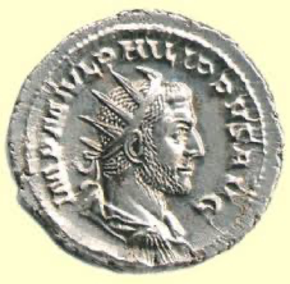

# John's Passion 約翰受難曲

Barry Lee 李萬基[^1] 2022.07.10

## An overview 概觀
1.         The Arrest of Jesus and Examination by the High Priest 耶穌的逮捕和大祭司的盤問: 18:1–27
            i. Judas leads a detachment of soldiers and Jewish police 猶大率領一支由士兵和猶太警察組成的分隊, vv 1–3
            ii. Jesus confronts the group 耶穌面對這群人, vv 4–9
	               (Read 18:3–6)
            iii. Peter attempts to defend Jesus 彼得試圖為耶穌辯護, vv 10–11
            iv. Jesus is led to the High Priest Annas 耶穌被帶到大祭司亞那那裡, vv 12–14
		            (Read 18:12–14)
            v. Peter’s first denial of Jesus 彼得第一次否認耶穌, vv 15–18
            vi. The interrogation of Jesus before Annas 在亞那面前審訊耶穌, vv 19–24
		            (Read 18:20–23)
            vii. Peter denies Jesus twice more 彼得又兩次否認耶穌, vv 25–27
2.         The Trial of Jesus before Pilate 彼拉多面前對耶穌的審判: 18:28–19:16a
            i. Jesus is handed over to Pilate 耶穌被交給彼拉多, vv 28–32
            ii. Pilate’s first interrogation of Jesus 彼拉多第一次審問耶穌, vv 33–38a
		            (Read 18:33–38)
            iii. Pilate’s declaration of the innocence of Jesus 彼拉多宣告耶穌無罪, vv 38b–40
            iv. Jesus is flogged and mocked by the soldiers 耶穌被士兵鞭打和戲弄, 19:1–3
            v. Jesus is presented as a mock-king and further declared innocent 耶穌被視為偽王，並進一步宣布無罪, vv 4–7
		            (Read 19:4–5)
            vi. Pilate’s second interrogation of Jesus and attempt to release him 彼拉多第二次審問耶穌並試圖釋放他, vv 8–12
		            (Read 19:10–11)
            vii. Jesus is sentenced to death by crucifixion 耶穌被判十字架之刑, vv 13–16a            
3.         The Crucifixion, Death, and Burial of Jesus 耶穌的受難、死亡和埋葬: 19:16b–42
            i. The crucifixion of Jesus 耶穌受難,vv 16b–18
		            (Read 19:16–18)
            ii. The title on the cross and Jewish objections to it 十字架上的標題和猶太人對其反對, vv 19–22
            iii. The dividing of Jesus’ clothes 分耶穌的衣服, vv 23–24
            iv. Jesus gives his Mother to the Beloved Disciple 耶穌將他的母親交給所愛的門徒, vv 25–27
            v. The death of Jesus 耶穌之死, vv 28–30
		            (Read 19:28–30)
            vi. The piercing of Jesus’ side 刺穿耶穌的肋旁, vv 31–37
            vii. The burial of Jesus 耶穌的埋葬, vv 38–42

- **What are the details of the Passion you've found missing in John? 在約翰福音中有什麼關於受難曲的細節是沒有被提及的呢？**

## Details of the Synoptic narratives not found in John 約翰福音中沒有的細節:[^2]
- Simon of Cyrene 古利奈人西門 (all three)
- Wailing women on the way to Calvary 在前往各各他的路上哭泣的婦女(Luke)
- Offering of drugged potion 提供沒藥調和的酒 (Mark/Matthew)
- Jesus’ prayer for the forgiveness of his executioners 耶穌祈求赦免劊子手的禱告 (Luke)
- Time indications 時間指示, e.g., 9 A.M. (Mark); noon to 3 P.M. (all three)
- Various mockeries 各種嘲諷 (all three)
- Repentance of the “good thief” 同釘犯人的懺悔 (Luke)
- Darkness over the land 黑暗籠罩大地 (all three)
- The cry “Eloi, Eloi, lama sabachthani” 以羅伊！以羅伊！拉馬撒巴各大尼？」（翻出來就是：我的上帝！我的上帝！為甚麼離棄我？(Mark/Matthew)
- The suggestion that he seeks deliverance by Elijah 求以利亞拯救 (Mark/Matthew)
- Jesus’ final loud cry 耶穌最後的大聲呼喊(all three)
- The words “Father, into your hands I commit my spirit” “父親，我將我的精神交託在你手中” (Luke)
- The rending of the temple curtain 幔子裂開 (all three)
- The earthquake and the opening of the tombs 地震和墳墓的開放 (Matthew)
- Reaction of the centurion 百夫長的反應 (all three)
- Repentance of the multitudes going home 回家的群眾悔改 (Luke)
- Pilate’s investigation to affirm the death of Jesus 彼拉多調查確認耶穌之死 (Mark)
- The wrapping of the body in a linen shroud 用亞麻裹屍布包裹身體 (all three)
- The presence of the women at the tomb 婦女在墳墓的存在 (all three)
- Purchase of spices by the women 婦女購買香膏(Luke)

## The Arrest of Jesus and Examination by the High Priest 耶穌的逮捕和大祭司的盤問: 18:1–27

### The Betrayal and arrest 背叛與逮捕(18:1-11)
- "Although Jesus dies at the hands of Roman power, he is not its victim but superintends the unfolding of the events that lead to his crucifixion. He virtually orchestrates his own arrest “儘管耶穌死於羅馬權力之手，但他不是受害者，而是監督導致他被釘十字架的事件的展開。他實際上策劃了自己的被捕(18:1–8)"[^3]
- "Various passages are cited to show ways in which Jesus’ death fulfills Scripture (19:24, 28, 36, 37). Jesus’ death is no accident of history, as if he were simply in the wrong place at the wrong time." “引用了各種經文來表明耶穌的死如何應驗聖經（19:24,28,36,37）。耶穌的死並非歷史的偶然，就好像他只是在錯誤的時間出現在了錯誤的地方。 " [^4]
- 18:1 When he had finished praying, Jesus left with his disciples and crossed the Kidron Valley. On the other side there was a garden, and he and his disciples went into it. Kidron Valley 耶穌說了這些話，就同門徒出去，過了汲淪溪。在那裏有一個園子，他和門徒進去了。
- 汲淪谷 (溪) 

- ### 18:5–6 I am he 我就是
	- **What is the famous incident missing from John's narrative 約翰的敘述中沒有提一件重要的事——是什麼呢??**
	- "In typical Johannine fashion, Jesus takes the initiative." “在典型的約翰風格中，耶穌採取了主動。” [^5]
	- Dialogue: “I Am He”  - divine name  對話：“我就是”——神聖的名字。
	- they drew back and fell to the ground. 他們就退後，倒在地上。
	- "the distinction between mere self-identification (“Jesus the Nazorean”) and decisive self-revelation“  (“the God of Abraham, Isaac and Jacob,” see 8:58) is by no means a hard-and-fast one." ” [^6] “我就是”是表明自己只是拿撒勒人耶穌，還是“亞伯拉罕、以撒和雅各的神”， 事實上不是那麼明確。
- 18:10 "Malchus does not reappear in the Gospel, but named characters—except for well-known Jewish and Roman authorities, such as Caiaphas and Pilate—typically are or become disciples of Jesus." “馬勒古斯並沒有再次出現在福音中，但命名的人物——除了著名的猶太和羅馬領袖，如該亞法和彼拉多——通常都成為了耶穌的門徒。” [^7]
- “Let these men go”; to fulfil word spoken “I did not loose a single one of those whom you gave me.” “讓這些人走吧”；兌現所說的話：“你所賜給我的人，我一個也不失落。” (6:39; 10:28; 17:12)
- Peter acts violently 彼得行駛暴力
- “Am I not to drink the cup…” Metaphor for death“ 我父給我的杯，我豈可不喝呢？……” 死亡的隱喻

### Jesus before the High Priest 耶穌在大祭司面前
- Vv 12-14 Before Annas (father in law) but in recollection of Caiaphas’ words “it was better to have one person die for the people”在亞那（岳父）之前，但回想該亞法的話“一個人替百姓死，免得整個民族滅亡” (11:49-52)
- Eyewitness detail “charcoal fire because it was cold” 目擊者詳述“因為天冷生了炭火”
- HP questions him 大祭司向他提問(19-24)
- Jesus: “I have spoken openly to the world” – universal message and nothing done secretly. “I have always taught in the synagogues and in the temple…I have said nothing in secret.” 耶穌：“我一向都是公開地對世人講話，我常在會堂和聖殿裏，就是猶太人聚集的地方教導人，我私下並沒有講甚麼。”
- Jesus struck – “Is that how you answer the HP?” 耶穌打了 - 你這樣回答大祭司嗎？
- Jesus : “If I have spoken wrongly, testify to the wrong…”耶穌：“假如我說的不對，你指證不對的地方……”
- He is sent bound to Caiaphas. 他被綁在該亞法那裡。

### Peter's denial 彼得的否認
Refers back to foot washing story 指回洗腳故事
1. Woman asks Peter by charcoal fire 女人用炭火問彼得
2. Unnamed male asks Peter 無名男性問彼得
3. One of the slaves “Did I not see you in the garden with him? 其中一名奴隸“我不是看見你同他在園子裏嗎？”

## The Trial of Jesus before Pilate 彼拉多面前對耶穌的審判: 18:28–19:16a

- The primary charge of the Jews is heard by Pilate in v 33: “Are you the King of the Jews”?  This is based on the charge laid by the Jewish leaders to Pilate. 彼拉多在第 33 節聽到了對猶太人的主要指控：“你是猶太人的王”嗎？這是基於猶太領袖向彼拉多提出的指控。
- John’s trial scene is dominated by the claim of Jesus to be King and the nature of his sovereignty and kingdom. 約翰的審判場景以耶穌為王的宣稱以及他的主權和國度的性質為主。
- Note the use of “king” and “kingdom” in the pericope. 請注意在經文中使用“王”和“國”。
- Finally, we find Jesus’ witness and self-confession as the true King (cf. 6:15). 最後，我們 看見耶穌的見證和自認是真正的君王

### 18:36 My kingdom is from another place 我的國不屬於這世界
- Jesus admits he is a king, "just as Nathanael and the crowds in Jerusalem confessed him to be" 耶穌承認他是一位君王，“正如拿但業和耶路撒冷的群眾所認為的一樣” [^8]
- A misunderstanding: "That Jesus’ kingship is not “**from this world**” does not mean that it is merely “spiritual” in the sense of being inward or subjective. It is not simply Christ reigning in the hearts of individuals." 誤解：“耶穌的王權不屬於這世界”，並不意味著它只含靈性上的意思， 即是一種「內在」或「主觀」的意義。它不僅僅是基督在個人心中掌權。 " [^9]
- "In the same way that “not from this world” implies “from heaven,” or “from above,” the notice that Jesus’ kingship is not “from here” implies that it is “from above” (3:31). In short, it comes not from Jerusalem or Rome, but from heaven, from the very presence of God, and therefore belongs to God" “就像「不屬於這世界」暗示「從天上來」或「從上頭來」一樣，暗示了耶穌的王權並不是「從這裡來」而是「從上面來」（3:31）。簡而言之，它不是來自耶路撒冷或羅馬，而是來自天堂，來自上帝的同在，因此屬於上帝” [^10]
- "Jesus’ kingship is not merely “spiritual” but eschatological, rather like the Holy City in Revelation, always coming down “out of heaven from God” (Rev 3:12; 21:2, 10)." “耶穌的王權不僅是「屬靈的」，而且是指向末世的，就像啟示錄中的聖城一樣，總是「由上帝那裏，從天而降」（啟 3:12；21:2, 10）。” [^11]
- Another reality 另一個現實

### 18:38 What is truth? 真理是甚麼呢？
- "Is the question meant to mock Jesus, or ridicule Jesus’ claim to know the truth? Is it asked sincerely, with a genuine desire to know?" “這個問題是要嘲弄耶穌，還是嘲諷耶穌自稱知道真理？是[彼拉多]真誠地問，想明白真理嗎？” [^12]
- "it tells us that Pilate has no clue what truth is, consequently that he is _not_ “from the truth” - “它告訴我們彼拉多不知道真相是什麼，因此他不是“來自真相” (v. 37)"[^13]
- "as far as the reader is concerned, the answer has already been given." “就讀者而言，已經給出了答案。” [^14]
	- Your word is the truth 你的道就是真理 (17:17)
	- I am the Way, and the Truth, and the Life 我就是道路、真理、生命 (14:6)

The only physical evidence that confirms the existence of Pilate is the Latin inscription found on a limestone block relating Pilate's tribute to Tiberius. The artefact, sometimes known as the Pilate Stone, was discovered in 1961. There is literary evidence also. 證實彼拉多存在的唯一物證是在石灰岩塊上發現的拉丁銘文，與彼拉多對提比略的致敬有關。這件文物，有時被稱為彼拉多石，於 1961 年被發現。也有文學證據。

### Jesus is flogged and mocked (19:1-16)  耶穌被鞭打和嘲笑
- 19:2 The crown was most likely made from great thorns of the date palm, as these were readily available. The crown was not as we tend to see in paintings make with twigs with thorns, but is better likened to an American Indian’s headdress, with thorns as large as the feathers. The use of such a crown signifies that Jesus was decked out as a king who was God. 皇冠很可能是由棗椰樹的大刺製成的，因為它們很容易得到。王冠不像我們在畫作中看到的那樣用帶刺的樹枝做的，而是更好地把它比作美洲印第安人的頭飾，荊棘和羽毛一樣大。使用這樣的冠冕象徵著耶穌被[諷刺地]裝扮成君王，就是神。

### 19:5 Here is the man! 看哪，這個人！
- The king? The man? 國王？普通人？
- "“Look, the man!” recalls the repeated references to Jesus as “this man” throughout the Gospel, usually by the Jewish authorities, and often with disdainful connotations “看，這個人！”回想起在整部福音書中反复提到耶穌是“這個人”，通常是由猶太當局，而且常常帶有輕蔑的含義(see 5:12; 9:16, 24; 11:47; 18:17, 29)."[^15]
- "It is as if Pilate is now saying to them, “Look, here is ‘the man’ you were looking for, and arrested and brought to me. Now what are you going to do with him?”" “就好像彼拉多現在對他們說，‘看，這就是你們要找的‘人’，他被逮捕並帶到我這裡來。現在你們要怎麼處置他？” [^16]
- "Pilate is not trying to elicit compassion from the Jewish leaders, but only to dramatize his impression that Jesus is a pathetic and therefore harmless figure as far as the Roman government is concerned." “彼拉多並不想引起猶太領袖的同情，而只是為了誇張他的印象，即耶穌是一個可悲的人物，因此就羅馬政府而言是無害的。” [^17]
- Cortez: "John uses this incident to portray Jesus as the true human who comes to inaugurate the reality of the new creation. As the anthrōpos, Jesus is the one who fulfills God’s creational purposes for humanity." 科爾特斯：“約翰利用這一事件將耶穌描繪成真正的人類，他來開啟新創造的現實。作為anthrōpos，耶穌是實現上帝對人類的創造目的的人。” [^18]

### 19:11 Power from above 上頭賜的權柄
- 19:11 Jesus answered, “You would have no power over me if it were not given to you from above. Therefore the one who handed me over to you is guilty of a greater sin.” 耶穌回答他：「若不是從上頭賜給你的，你就毫無權柄辦我，所以，把我交給你的那人罪更重了。」
- Why "therefore"? 為什麼說「所以」呢？
- "Jesus’ assertion that Pilate does not have “any authority over me except what has been given . . . from above” (19:11) echoes a common theme that runs throughout the Bible and Jewish literature: all the governments of the earth, and this includes the kings and kingdom of Israel, exist only by God’s permission and authority."[^19] 耶穌斷言彼拉多“若不是從上頭賜給你的，你就毫無權柄辦我”（19:11） 。這句說話呼應了貫穿整個聖經和猶太文獻的一個共同主題：地球上的所有政府，包括以色列的一切「王」和「國」，都只有在上帝的許可和 權柄下才能存在。
- "Because they do, they are answerable to God for their conduct and actions and can and will be judged or replaced as they fail to honor the God who gives them authority and to practice justice in their dealings with all people (cf. Dan 2:20–23; Rom 13:1–7)."[^20] 因為他們這樣做，所以他們要為自己的行為和行為向上帝負責，並且將會受到審判或取代，因為他們沒有尊重賦予他們權力的上帝，也沒有行正義（參見但 2:20 –23；羅馬書 13：1-7）。
- Is Pilate guilty? 彼拉多有罪嗎？
	- "In John’s view that Jesus’ death was the result of God’s purposes and Jesus’ own volition, as well as the act of those hostile to Jesus and to God “在約翰看來，耶穌的死是上帝的旨意和耶穌自己的意志的結果，也同是那些敵視耶穌和上帝的人的行為結果。
	- this Gospel reflects the New Testament’s understanding of the mysterious confluence of divine purpose and human agency that brought about Jesus’ death. 這本福音書反映了新約理解耶穌死亡，是一種「神聖旨意」和「人類選擇」的神秘融合。
	- Even if Pilate’s actions serve the purposes of God, he is not thereby exonerated..."[^21] 即使彼拉多的行為[看似]成就了上帝的旨意，他也不能因此被赦免……”
- An analogy 一個比喻

## The Crucifixion, Death, and Burial of Jesus 耶穌的受難、死亡和埋葬: 19:16b–42

### 19:26 Here is your son; here is your mother 看，你的兒子；看，你的母親
- I would suggest that the evangelist chose to use this term in both stories, not just because Jesus has disengaged with his mother in her parental authority, but because she represents women in their pilgrimage toward full faith in Jesus. 我認為作者在這兩個故事中都選擇使用這個詞，不僅因為耶穌已經脫離了母親對他那種父母的權威，還因為她代表了一種女性朝聖之路——讓信心圓滿。
- We see Mary making progress from believing in Jesus as the wonder-worker, but remaining with her physical family, to joining the family of faith.  我們看到馬利亞從相信耶穌是行奇蹟者（她仍是肉身家庭成員），進到「信仰的大家庭」裡。
- There is a sense in which Jesus resolves the tension in his mother’s two roles as mother and disciple, by indicating that she must relate to him as a woman, not as his mother. 從某種意義上說，馬利亞雖身為耶穌母親，但也同時是門徒，這兩種角色帶來了張力； 耶穌解決了這種張力， 就是要她被稱為「婦人」， 而不是「母親」。
- As she loses Jesus both in the physical and the spiritual sense, she gains a new family, the BD being her first ‘son’ in the faith.當她在身體和精神上都失去了耶穌[這個兒子]時，她獲得了一個新的家庭，「所愛的門徒」就是她在信仰中的第一個“兒子”。
- Discipleship then must be seen in the larger context in which Mary’s role must be defined. She can be a spiritual mother in the church, but she is not depicted here as the mother of the church, for the BD ‘s discipleship precedes hers, and only he is called a “disciple” in this scene. 因此，「什麼是門徒」 必須更廣闊地來看，就是從定義馬利亞的角色來看。她或許可避說是教會的屬靈母親，但[在約翰福音]並沒有將她描繪成教會的母親，因為「所愛的門徒」 比起她更先成為門徒，只有他在這個場景中被稱為“門徒”。
- Nonetheless, both are addressed and both receive a commission from Jesus at this juncture…. 儘管如此，兩位角色都被提及，並且都在此時此刻接受了耶穌的委託……
- “The Fourth Evangelist’s vision of male-female equality in the Christian community entails an incorporation of the physical family into the family of faith, and a reinterpretation of the physical family roles in light of the priorities of faith.” “第四福音作者對基督教社區男女平等的願景要求將「肉身家庭」納入「信仰家庭」，並根據信仰的優先順序重新解釋「肉體家庭」的角色。”
- Having achieved the reconciliation of the physical family and the family of faith, the Fourth Evangelist suggests Jesus has basically completed his work, for the story is directly followed by the words, “After this, when Jesus knew that all was now finished…” (v.28).  實現了肉身家庭與信仰家庭的和好，第四福音作者暗示耶穌已經基本完成了他的工作，因為故事的後面緊跟著一句話：“在這之後，當耶穌知道現在一切都完成了……”

### 19:28–30 I am thirsty 我渴了; the death of Jesus
- 19:28 The giving of a drink to Jesus on the cross is described in various ways in the Gospels. 福音書中以不同的方式描述了在十字架上給耶穌喝水。
- The offering of wine mixed with myrrh, mentioned by Mark (15:22) is a different incident; it preceded the act of crucifying, and was prepared by women to dull the senses and lessen the pain; this drink Jesus refused to take. 馬可（15:22）提到的用沒藥混合的酒是另一回事。它是在釘十字架前發生的一件事，沒藥混合的酒是由一些女士所準備，用來麻痺感官和減輕痛苦；但耶穌拒絕喝這種飲料。
- Luke records the mockery of Jesus by the rulers and the soldiers, and in that context states that the soldiers gave Jesus oxos (cheap wine) to drink (Luke 23:36). 路加記錄了統治者和士兵對耶穌的嘲弄，在這種情況下，士兵們給耶穌喝了 oxos（廉價酒）（路加福音 23:36）。
- Mark and Matthew place the event immediately following the cry of desolation (Mark 15:34–36 par. My God, my God why have you forsaken me); the impression is given that bystanders thought that Jesus was calling on Elijah for help, and they gave the drink to help him, as they waited to see if Elijah came to save him. 馬可和馬太 把這事記錄在淒涼的呼喊之後（馬可福音 15:34-36 par. 我的上帝，我的上帝，你為什麼離棄我）；給人的印像是，旁觀者認為耶穌是在呼喚以利亞來尋求幫助，於是他們遞了酒來幫助他，他們在等著看以利亞是否來救他。
- It is clear the precise timing of this event, but we may acknowledge that: 很清楚這一事件的確切時間，但我們可以認為：
            - it happened just before Jesus died; 這發生在耶穌死前；
                        - the giving of the wine was the action of a soldier; the wine belonged to the guard standing by, and no one would have dared to take some of it and give it to a man on a cross. 送酒是士兵的行為；酒是站在一旁的守衛的，誰也不敢拿來分給一個被釘在十字架上的人。
- Hyssop 牛膝草
	- "Hyssop was the plant used to smear the blood of the Passover lamb on the doorposts of the Israelites 牛膝草是用來在以色列人的門框上塗抹逾越節羔羊血的植物 (Exod 12:22)."[^22]
	- "More frequently in the Bible, hyssop is associated with purification both from the impurity contracted from leprosy and from a corpse“ 在聖經中更常見的是，牛膝草與淨化麻風病和屍體的雜質有關 (Lev 14:4, 6, 49, 51–52; Num 19:6, 18; Heb 9:19), 
	- and from moral defilement caused by sin; thus the psalmist prays, “Purge me with hyssop, and I shall be clean” 以及因罪造成的道德玷污；詩人這樣禱告說：“用牛膝草洗淨我，我就潔淨了” (Ps 51:7)."[^23]
	- "Perhaps hyssop here connects Jesus’ death to purification from sin, but the Gospel provides no clue that the hyssop should be understood symbolically." - “也許這裡的牛膝草將耶穌的死與罪孽的淨化聯繫起來，但福音沒有提供任何線索表明牛膝草應作符號來理解。” [^24]
- Jesus’ death is introduced with the words, “Jesus knew that all was now accomplished,” (19:28) A sign is now given for this “accomplishment.” This was the fulfilment of a particular scripture passage. 耶穌的死是用這樣的話來介紹的，“耶穌知道各樣的事已經成了”, 現在為這個“完成” 顯出一個徵兆，就是特定經文的應驗。
- Jesus cries, “I thirst.” Both the thirst and the action in seeking to satisfy it belong to the fulfilment of the Scripture, namely Ps 69:22: “They gave me vinegar for my thirst.” John draws heavily on Ps 69 in his Gospel using it three times. 耶穌喊道：“我渴了。”口渴和解渴的行動都應驗聖經，即詩篇 69:22：“我渴了，他們拿醋給我喝。”約翰在他的福音書中大量引用了第 69 篇，使用了 3 次。
            - Cleansing the temple 潔淨聖殿(2:17) (Ps 69:9)
            - In the teaching about the world hating the disciples 在關於世界憎恨門徒的教導中 (15:25) (他們無故地恨我) (Ps 69:4)
            - On the cross在十字架上 (19:28) (Ps 69:22)
          
### 19:30 It is finished 成了

**Is this picture a Johannine or Synoptic description? 這幅圖畫所描繪的是約翰福音或是同觀福音的意象?**

Two meanings are conveyed to the words “it is finished”: “完成了”這個詞有兩種含義：
1. end of life – temporal meaning. 生命的終結——時間意義。
2. The final and high point of the work that the Son has performed in obedience to the Father. The Son caries out the will of the Father (12:27; 17:4) and so brings glory to his name 子為順從父所做的工作的最後和最高點。聖子遵行聖父的旨意（12:27；17:4），因此榮耀他的名 (12:23, 28, 31-32).

He bowed his head and “gave up” (handed over – paradidōmi) his spirit. 他低下頭，“捨下”（交出——paradidōmi）他的靈魂。

### 19:34 Blood and water 血和水
- haemothorax:[^25] accumulation of blood in the pleural cavity (the space between the lungs and the walls of the chest) 血胸: 胸膜腔內的血液堆積
	- "the fluid must have accumulated during life by a bleeding into the chest cavity, almost certainly due to the savage flagellation." 液體一定是還活的時候中血流進胸腔而積累起來的，幾乎可以肯定是由於野蠻的鞭打所導致。
![[john-19-blood-and-water.png]]
- BUT let's go beyond science and into symbolism. 但是，讓我們超越科學，進入經文的比喻。
- 4:14 but whoever drinks the water I give them will never thirst. Indeed, the water I give them will become in them a spring of water welling up to eternal life. 誰喝我所賜的水，就永遠不渴。我所賜的水要在他裏面成為泉源，直湧到永生。
- 7:37–38 Let anyone who is thirsty come to me and drink. Whoever believes in me, as Scripture has said, rivers of living water will flow from within them. 人若渴了，到我這裏來喝！信我的人，就如經上所說：『從他腹中將流出活水的江河來。』
- Water: force of life 水：生命的力量
- Blood: result of death 血：死亡的結果
- "Now the blood and the water appear together, as a graphic reminder that life (represented by water) emerges from death, the shedding of blood."[^26] “現在血和水一起出現，作為一個寫實的描述，就是說生命（以水為代表）從死亡（以血為代表）中冒起。
- NOT: an "“institutional” interpretation of the “blood and water”—that is, symbolizing the Eucharist and Baptism respectively" [^27]「血和水」不應被「體制化」來解釋——即分別象徵聖餐禮和洗禮
            - "Nothing corresponds to the eucharistic bread"- “沒有什麼與聖體裏的餅相對應”
            - "it is the symbolism not of sprinkling or washing but of “drinking,” that is, simply “coming” to Jesus and believing in him“它不是灑水或洗滌的象徵意義，而是“喝”的象徵意義，即簡單地“來”耶穌面前並相信他 (see 7:37–38)"

## Why did John shape his Passion Narrative in the way he did? 為什麼約翰這方式描繪受難？

1. John stressed Jesus dying as the Passover lamb. We can see this by 約翰強調耶穌像逾越節的羔羊一樣死去。我們可以通過[幾件事來看]:
	- the mention of his legs not being broken 提到他的腿沒有被打斷 (Exod 12:46; Num 9:12)
	- the mention of the hyssop which was used to sprinkle the blood on the doorposts as Passover 提到牛膝草，它被用來在門柱上塗血過逾越節(Exod 12:12)
	- the mention of his dying on the day the Passover lambs were slaughtered. 提到他在逾越節羔羊被宰殺的那天去世。
	- He is the lamb that takes away the sin of the world (John 1:29). Although the Passover lamb preserved the families whose doorposts had the blood on them, while the festival was not about dealing with sin. 他是除去世人罪孽的羔羊（約翰福音1:29）。雖然逾越節羔羊保護了門柱上塗血的家庭，但這個節日並不是為了對付罪。
2. Jesus is also positioned as the universal Saviour. We see this in 2 ways: 耶穌也被定為全人類救主。我們通過兩種方式看到這一點：
	- the use of the three languages so all the world can read he is the King of the Jews. 使用這三種語言讓[當時]全世界都可以明白他是猶太人的王。
	- The two major figures who are unnamed people at the cross: the beloved disciple and an unnamed woman (Witherington, John’s Wisdom, 313). Is new humanity pictured here? 在十字架上無名的兩個主要人物：[無名的]所愛的門徒和無名的女人（Witherington, John’s Wisdom, 313）。這裡描繪的象徵所有新人類嗎？
3. Jesus dies as a King enthroned on the cross in the narrative. 在敘述中，耶穌死在十字架上， 就是他作為王的「登基」儀式。
	- The trial strongly highlights this (18:33-14:16). Jesus is charged as claiming to be ‘king of the Jews’ 審判強烈地強調了這一點（18:33-14:16）。耶穌被指控自稱是“猶太人的王” (18:33).
	- the sign which hung above the cross written by Pilate 懸掛在十字架上彼拉多所寫的標題 (19:19-22).
	- the repeated language ‘king’ in the trial narrative. 審判敘事中重複提及「王」。
	- the crown of thorns and the purple robe which represent royalty (shared with Mark and Matthew). 荊棘冠冕和代表皇室的紫色長袍（見馬可和馬太）。
4. Jesus is sovereign in his death and thus his deity is seen. 耶穌在他的死中是至高無上的，因此他的神性可見一斑。
	- He gives over his life; it is not taken from him. 他獻出生命；生命從不是被拿走的。
	- He has control over the events, including his death. 他可以控制事件，包括他的死亡。
	- The use of the divine name in the garden (18:5, 6, 8) and when spoken those in the garden step back and fall to the ground- 在園中說出神聖的名字（18:5、6、8），園裡的人退後倒地 (18:6).

## Conclusion 總結
- Jesus takes full control of his own destiny to the cross. And he takes full control of human destiny, despite our rebellion. 耶穌在走上十字架的事情上，完全掌控了自己的命運。 同樣地，儘管人類叛逆，但他依然完全掌握了人類的終局。
- Jesus's kingdom is "from above"—in today's term—from another dimension, universe or reality. As Christians, we must become aware of this "from above" reality, and constant remind ourselves of it. 耶穌的國度是“從上頭來的”——用今天的話說——來自另一個維度、宇宙或現實。 作為基督徒，我們必須意識到這個“從上面來”的現實，並不斷提醒自己。
- All earthly regimes are given power "from above" and will be judged whether they have done good or evil. 所有地上的政權都“從上頭”被賦予權力，但根據他們做了善事或惡事而被審判。
- Jesus as the "anthrōpos" has inaugurated the new beginning of humanity through his death (cf. blood and water)—we Christians are the new humankind brought forth by the cross. 耶穌作為“人類”通過他的死展開了人類的新開端（參見血與水）——我們基督徒就是十字架帶來的新人類。

[^1]: Details and pictures without specific footnotes are taken from Dr Sarah Harris's lecture on John, Carey Baptist College, 2022; the conclusion is my own.
[^2]: Raymond E. Brown, The Gospel according to John (XIII-XXI): Introduction, Translation, and Notes, vol. 29A, Anchor Yale Bible (New Haven; London: Yale University Press, 2008), 914.
[^3]: Thompson, *John*, 360.
[^4]: Thompson, *John*, 360.
[^5]: J. Ramsey Michaels, [_The Gospel of John_](https://ref.ly/logosres/nicnt64jn3?ref=Bible.Jn18.5&off=809&ctx=dentify+himself.%E2%80%9D17+~In+typical+Johannine), The New International Commentary on the Old and New Testament (Grand Rapids, MI; Cambridge, UK: William B. Eerdmans Publishing Company, 2010), 889.
[^6]: Michaels, _The Gospel of John_, 890.
[^7]: Thompson, *John*, 364–5.
[^8]: Michaels, _The Gospel of John_, 922.
[^9]: Michaels, _The Gospel of John_, 922.
[^10]: Michaels, _The Gospel of John_, 923.
[^11]: Michaels, _The Gospel of John_, 923.
[^12]: Thompson, *John*, 381.
[^13]: Michaels, _The Gospel of John_, 925.
[^14]: Michaels, _The Gospel of John_, 926.
[^15]: Michaels, _The Gospel of John_, 930.
[^16]: Michaels, _The Gospel of John_, 930.
[^17]: Michaels, _The Gospel of John_, 931.
[^18]: Marc Cortez, _ReSourcing Theological Anthropology: A Constructive Account of Humanity in the Light of Christ_ (Grand Rapids, MI: Zondervan, 2017), 30.
[^19]: Thompson, *John*, 385.
[^20]: Thompson, *John*, 385.
[^21]: Thompson, *John*, 386.
[^22]: Thompson, *John*, 401.
[^23]: Thompson, *John*, 401.
[^24]: Thompson, *John*, 401.
[^25]: Kathleen N. Hattrup, "A doctor on why 'blood and water' gushed from Jesus' heart", Aleteia, https://aleteia.org/2019/06/22/a-doctor-on-why-blood-and-water-gushed-from-jesus-heart/
[^26]: Michaels, _The Gospel of John_, 969.
[^27]: Michaels, _The Gospel of John_, 969.
[^28]: Thompson, *John*, 401.
[^29]: Beasley-Murray, *John*, 335-336.
