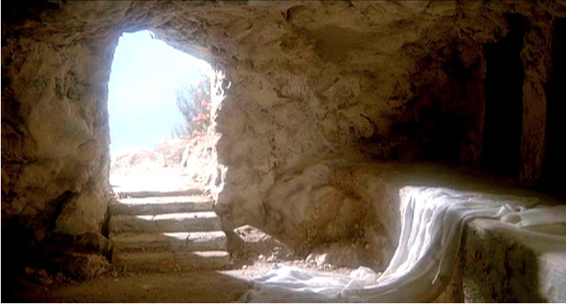

# John 20–21 Resurrection and encounters  復活與重遇
Barry Lee 李萬基 2022.07.17

- Thank God Jesus's crucifixation is not the end of the story! 感謝主耶穌被釘十字架並不是故事的結局！

## Potential topics for next week 下週題目
- 愛於平凡: 約翰福音的領袖觀 Love in the ordinary: Leadership in the Gospel of John
- 約翰福音之創造更新 Creation’s Renewal in the Gospel of John
- 反猶太教的來由與約翰福音 Anti-Semitism and the Gospel of John
- 眼見為真：約翰福音的「信」 Seeing is believing: Johannine Concepts of Faith
- 人物研究: 馬利亞和馬大 Character study: Mary and Martha

## An overview 故事大綱

- 20:1–10 The Discovery of the Empty Tomb 發現空墳墓
- 20:11–18 Jesus Appears to Mary: The Good Shepherd Calls His Own 耶穌向馬利亞顯現：好牧人的呼召
- 20:19–23 Jesus Appears to His Disciples: The Giving of the Holy Spirit 耶穌向門徒顯現：賜予聖靈
- 20:24–31 Jesus Appears to Thomas: The Call to Faith 耶穌向多馬顯現：信仰的呼召
- 21:1–25 Jesus Appears to His Disciples in Galilee: The Call to Follow 耶穌在加利利向門徒顯現：追隨的呼召

## Questions 本週之謎
- Why did the BD "see and believe" (20:8) but "still not understand" (20:9)? 為什麼「所愛的門徒」“看見就信”（20:8）但“還不明白”（20:9）呢？
- About sight 關於「看」:
	- Why was Mary not able to tell what she saw when she encountered the angels or Jesus? (20:13-16) 為什麼馬利亞不論看到天使還是耶穌都不能辨認出來？ (20:13-16)
	- 21:4 How come the disciples didn't recognise Jesus? 為什麼門徒不認得耶穌(21:4)？
- Who are Jesus's brothers (20:17)? 誰是耶穌的兄弟（20:17）？
- When excacty did the disciples receive the Holy Spirit? According to John, or Acts? 門徒是在什麼時候接受聖靈的？ 根據約翰福音，還是使徒行傳？
- Why 153 fish?

## 20:1–10 The Discovery of the  Tomb 發現空墳墓

- Why did the BD "see and believe" (20:8) but "still not understand" (20:9)? 為什麼「所愛的門徒」“看見就信”（20:8）但“還不明白”（20:9）呢？
	- Draw parallel from the farewell discourse 回帶看看告別對話:
		- 14:28 You heard me say, ‘I am going away and I am coming back to you.’ If you loved me, you would be glad that I am **going to the Father**, for the Father is greater than I. 29 I have told you now before it happens, so that when it does happen you will **believe**. 你們聽見我對你們說過，我去了還要回到你們這裏來。你們若愛我，就會因我**到父那裏去**而喜樂，因為父比我大。 現在事情還沒有發生，我預先告訴你們，使你們在事情發生的時候會**信**。
		- "While his (BD's) belief is exactly what Jesus intended (14:29), it is not full-fledged resurrection faith."[^3] 雖然他(BD)的「相信」正是耶穌所想要的（14:29），但還不是對復活的一種成熟信仰。
		- 14:28 You heard me say, ‘I am **going away** and I am **coming back** to you.’ If you loved me, you would be glad that I am going to the Father, for the Father is greater than I. 29 I have told you now before it happens, so that when it does happen you will believe. 你們聽見我對你們說過，我**去了**還要**回到**你們這裏來。你們若愛我，就會因我到父那裏去而喜樂，因為父比我大。 現在事情還沒有發生，我預先告訴你們，使你們在事情發生的時候會信。
		- "True resurrection faith comes to expression [] not when the beloved disciple “saw and believed,” but only when Mary is able to say, “I have seen the Lord” (v. 18), and later when the gathered disciples “rejoiced at seeing the Lord” (v. 20; also v. 25)."[^4] 對復活真正的信心，不是當心愛的門徒“看見就信了”，而是當馬利亞能夠說：“我已經看見了主”（第 18 節），和稍後當門徒聚集“看見主就喜樂了”（第 20 節；也第 25 節）。
		- "The faith of “the disciple whom Jesus loved,” while no less genuine, is to that extent a limited faith."[^5] “耶穌所愛的門徒”的「信」，雖然同樣真誠，但在某種程度上是一種有限的信心。

## 20:11–18 Jesus Appears to Mary 耶穌向馬利亞顯現

- THE GARDEN imagery 園子的意象
- Why was Mary not able to tell what she saw when she encountered the angels or Jesus? (20:13-16) 為什麼馬利亞不論看到天使還是耶穌都不能辨認出來？ (20:13-16)
	- "Her vision of two angels in white trumps Peter’s vision of scattered graveclothes (v. 6) and possibly the beloved disciple’s vision as well, yet it produces no faith."[^6] 她看到兩個天使，勝過彼得看到裹屍布（第 6 節），也勝過「所愛門徒」所看見的。 但即使看見了，她卻沒有相信。
	- "someone has taken away the body for reburial" 有人把屍體拿走重新安葬
	- "Her failure to recognize him, while not paralleled in Matthew, is consistent with certain other resurrection appearances in which **the risen Jesus’ identity is similarly concealed, at least temporarily, from his disciples** (see 21:4; Lk 24:16)."[^7] 她沒有認出他，雖然在馬太福音不是這樣說，但與其他復活顯現的情況是一致的，就是**耶穌的復活形體對他的門徒同樣不是顯而易見的，至少是暫時性的現象**（見 21:4；路 24： 16）。
	- "Again she is described as “turning,” a term that sounds redundant after she has already “turned around” from the vision in the tomb to face Jesus. This time, perhaps, it refers to her state of mind no less than to her body language, yet, as we will see (v. 17), she may have turned her body toward Jesus as well."[^8] 她再次被描述為“轉過身來”，在她已經從墳墓中“轉過身來”看見耶穌之後，這個描述聽起來很多餘。這一次，也許指的是她的心態，不是於她的肢體語言，然而，正如我們將看到的（第 17 節），她也可能同時將她的身體轉向了耶穌。
	- "As one who “knows his voice” (see 10:4–5), she responds to his one word, “Mary!” with a one-word answer of her own—“Rabbouni,” literally “my Teacher”"[^9] 作為一個“認得他的聲音”（見 10：4-5）的人，她回應了耶穌叫他馬利亞，她自己用一個詞回答——“拉波尼”，意思是“老師”。
- 20:17 Jesus said, “Do not hold on to me, for I have not yet ascended to the Father. Go instead to my brothers and tell them, ‘I am ascending to my Father and your Father, to my God and your God.’ ” 耶穌對她說：「不要拉住我，因為我還沒有升上去見我的父。你到我弟兄那裏去告訴他們，我要升上去見我的父，也是你們的父，見我的上帝，也是你們的上帝。」
	- Why "do not hold on to me"? "the longer she stayed with Jesus, the later she would be in delivering the message Jesus gave her"[^10] 為什麼說「不要拉住我」？她與耶穌在一起的時間越長，她轉達信息的時間就越遲。
	- Who are Jesus's brothers? 耶穌的兄弟是指誰呢？
	- "the term “brothers” refers to the disciples, for it is to them that Mary will deliver the message (v. 18)."[^11] “兄弟”一詞是指門徒，因為馬利亞將向他們傳達信息（第 18 節）。
	- Significance: "Yet the two stories (both John and Matthew) have in common the sending of the woman (or women) to the disciples with a message"[^12] 重大意義：“然而，這兩個故事（約翰和馬太）有一個共同點，就是差派一個女人（或幾個女人）送信息給門徒
	- Monogenēs 獨一無二的關係

## 20:19–23 Jesus Appears to His Disciples 耶穌向門徒顯現

- When excacty did the disciples receive the Holy Spirit? According to John, or Acts? 門徒是在什麼時候接受聖靈的？ 根據約翰福音，還是使徒行傳？
- 20:22 And with that he breathed on them and said, “Receive the Holy Spirit. 說了這話，他向他們吹一口氣，說：「領受聖靈吧！
	- Gen 2:7 Then the Lord God formed a man w from the dust of the ground and breathed into his nostrils the breath of life, and the man became a living being. 耶和華上帝用地上的塵土造人，將生命之氣吹進他的鼻孔，這人就成了有靈的活人。
	- "Here the Spirit is both the evidence of resurrection—that is, that Jesus is alive—and the empowerment of the disciples to do what he has just sent them to do."[^13] 在這裡，聖靈既是復活的憑據——證明耶穌還「活」著——也賜能力給門徒去做被差遣的事。
	- In short, the accent is on “Life,” even as Jesus is alive (14:19), not on a new personal Companion to be with them forever and lead them into all the truth.[^14] 簡而言之，[領受聖靈]重點是“生命”，即耶穌還「活」著（14:19），而不是着重於有一個新「陪伴者」永遠與他們同在並帶領他們進入所有的真理
	- "In both passages the role of the Spirit is to equip the disciples for mission; the difference between them is not that the Spirit is personal in Acts 2 and not in John 20. It is rather that the Spirit is represented in Acts 2 as “Power” and in John 20 as “Life.”"[^15] 在這兩段經文中，聖靈的角色是裝備門徒去傳教。它們之間的區別不在於聖靈在使徒行傳 第二章中是有位格的，而約翰福音第20章卻沒有。而是在使徒行傳第二章中，聖靈象徵了“能力”，而在約翰福音第20章卻象徵了“生命”。
	- Thus when Jesus breathes on the disciples and says, “Receive Holy Spirit,” it is not an anticipation of Pentecost, but “Pentecost” itself—the only coming of the Spirit of which this Gospel knows.[^16] 因此，當耶穌向門徒吹氣並說：“領受聖靈”時，這並不是對五旬節的一種展望，而本身就是“五旬節”——這是本福音所知道唯一的聖靈降臨。
	- "John is not recording in vv 19-23 something that took place in five minutes on the first Easter Sunday evening. In briefest compass he summarizes the acts of the risen Lord, bringing together sayings and happenings uttered and performed in the Easter period. The gift of the Spirit could have been at any time within the Easter period."[^19] 約翰在 19-23 節 並不是說，復活節當天晚上五分鐘內發生的事。 他用最簡短的描述概括了復活的主的作為，將復活節期間所說和所做的事件匯在一起。「領受聖靈」可能發生在復活節期的任何時候。
	- "It is important to note that both John and Luke are capable of accommodating chronology to theology when it seems right to do so."[^18] 重要的是，約翰和路加都在 合情理的情況下，用「時間性」來遷就「神學」。
	- "The Fourth Evangelist wrote one volume only, not two, as Luke. What he wrote concerning the coming of the Spirit was theologically and historically sound"[^17] 第四位福音作者只寫了一卷書，而不是像路加的兩卷書。 他所寫的關於聖靈降臨的內容在神學上和歷史上都是合理的。

## 20:24–31 Jesus Appears to Thomas 耶穌向多馬顯現

- 20:29 Then Jesus told him, “Because you have seen me, you have believed; blessed are those who have not seen and yet have believed.” 耶穌對他說：「你因為看見了我才信嗎？那沒有看見卻信的有福了。」
- Points to the readers 指向福音書讀者
- "Here Jesus speaks of these “other sheep” or “children of God” as if they have _already_ believed, knowing that when they do believe, it will in fact be without seeing, at least in the way Thomas and his fellow disciples have seen."[^20] 耶穌在這裡談到這些“另外的羊”或“上帝的兒女”，好像他們「已經」相信了， 其實是預知當他們相信時，實際上並「 沒有看見」的，和多馬和他的門徒們所經歷並不一樣。
- "while Thomas’s faith by sight is accepted, the faith without sight expected of John’s audience is greater (20:29; cf. 2 Cor 5:6–7; 1 Pet 1:8)."[^21] 多馬「看而相信」是可以接受的， 但沒有看見而相信則更好， 就是指約翰福音的讀者。
- "Thomas had been a disciple; he was prepared to die for Jesus (11:16) and to follow where he led (14:5); but his faith was insufficient (20:29)."[^22] 多馬是門徒；他曾準備為耶穌而死（11:16）並跟隨到耶穌任何地方（14:5）；但他的「信」看來還是不夠（20:29）
- "Throughout the Gospel, many people become initial believers, but their initial faith proves insufficient without perseverance (2:23–25; 8:30, 59). John’s goal is not simply initial faith but persevering faith, discipleship (8:30–32; 15:4–7). John’s purpose is to address believers at a lesser stage of discipleship and to invite them to persevere as true disciples."[^23] 在整部福音書中，許多人初步成為信徒，但如果沒有堅持，他們起步的信仰是不夠的（2:23-25；8:30, 59）。 約翰福音的目標不僅僅是起步的信仰，而是堅持不懈的信仰和成為門徒（8：30-32；15：4-7）。 約翰福音的目的是向初信、初作門徒的人說話，並邀請他們堅持下去作「真正」的門徒。

## Recap for Ch 20 第20章總結
- As disciples, we may "see and believe" (20:8) first, "understand" (20:9) later, and finally "experience" the resurrected Jesus (the rest of Ch 20). 作為門徒，我們可能先“看見就相信”（20:8），然後“明白”（20:9），最後才“經歷”復活的耶穌（20 章的其餘部分）。
- Do we have a "resurrection faith"? Where are we in our faith journey? 我們有“復活的信仰”嗎？ 我們的信仰之旅如今在那個階段呢？

## 21:1–25 Jesus Appears to His Disciples in Galilee 耶穌在加利利向門徒顯然

- 21:2 Simon Peter, Thomas (also known as Didymus), Nathanael from Cana in Galilee, the sons of Zebedee, and two other disciples were together. 西門．彼得、叫低土馬的多馬、加利利的迦拿人拿但業、西庇太的兩個兒子，和另外兩個門徒，都在一起。
	- Who is the BD? 誰是「所愛的門徒」呢？
- 21:5 He called out to them, “**Friends**, haven’t you any fish?” 耶穌就對他們說：「孩子們！你們有吃的沒有？」他們回答他：「沒有。」
	- Are the disciples friends or children (also see 13:33, 15:15)? 門徒究竟是朋友還是孩子們呢？
	- "Although Jesus has called them “friends,” he is still their Teacher and Lord, as his address to them as children (*paidia*), emphasizing their continued dependence."[^24] 儘管耶穌稱他們為“朋友”，但他仍然是他們的老師和主， 當他叫他們為「孩子們」（*paidia*），強調他們需要繼續依賴他們的主。

### 153 fish 一百五十三條大魚 

1. Jerome thought that Greek sources of his day indicated that there were 153 kinds of fish; the catch was thought, then, to symbolize the universal scope of Jesus’ mission. Jerome認為他那個時代希臘資料說明魚有 153 種；因此認為這個漁獲象徵著耶穌使命的普遍性。
2. Many have followed Augustine, who pointed out that 153 is the sum of the successive numbers from one to seventeen... Augustine posited that seventeen itself was the sum of ten, the number of the commandments of the law, and seven, the day of creation first associated with sanctification and hence symbolic of the Holy Spirit. Thus ten and seven represent, respectively, the old and new covenants, law and grace... 許多人認同奧古斯丁的說法：他指出 153 是從 1 到 17 的連續數字的總和……奧古斯丁假設 17 本身就是「十」誡的數量和創造裡「七」日的總和，與「成聖」過程相關聯，因此象徵著聖靈。因此十和七分別代表舊約和新約、律法和恩典……
3. the numerical value of the Hebrew phrase bĕnê ha-ʾĕlōhîm (“sons” or “children of God”) is 153... 希伯來語短語 bĕnê ha-ʾĕlōhîm（“兒子”或“上帝的孩子”）的數值是 153
4. some commentators dismiss all symbolic interpretations. Elsewhere, in narrating miracles of “supply” or “provision,” the Gospel calls attention to the size and volume of the water jars (2:6) and the number of baskets of bread gathered after the feeding of the five thousand (6:13). 一些解經家不認同所有寓意解釋。在福音其他地方，在敘述“上帝的供應”有關的神蹟時，都特別記載[數量]，例如水缸的體積（2:6），以及餵飽五千人後收集的麵包籃的數量（6: 13）。

There is nothing meager about Jesus’ provision... here the fish are caught without tearing the nets: nothing is lost, evocative of both Jesus’ abundant provision and sovereign care. [^25] 耶穌的供應並不微薄……在這裡，魚極多但不破網： [象徵着]沒有任何損失，這讓人想起耶穌豐富的供應和超然的關懷。

### Jesus's appearance 耶穌顯現 20:12–14
- 20:12 Jesus said to them, “Come and have breakfast.” None of the disciples dared ask him, “Who are you?” They knew it was the Lord. 耶穌對他們說：「你們來吃早飯。」門徒中沒有一個敢問他：「你是誰？」因為他們知道他是主。
- "Yet the comment “none of them dared to ask him,” coupled with their initial failure to recognize him, suggests that Jesus’ appearance was unexpected or perhaps unrecognizable."[^26] 然而，“他們都不敢問他”這種敘述，加上他們最初未能認出他，表明耶穌當時的外貌是預期之外的，或者可能是無法認出的。
- LESSON FOR US: "Jesus remains with his disciples, wherever they are and whatever they are doing: he has not left them alone; he continues to provide for them (14:18; 15:1–11)."[^27] 給我們的功課：“耶穌與他的門徒在一起，不論何處，不論何事，他也沒有撇棄他們，繼續供應他們（14:18；15:1-11）。”

### Jesus Reinstates Peter 三問彼得

One interpretation 一種解說:

| Jesus’ question 耶穌探問             | Peter’s response 彼得回應                                                 | Jesus’ charge 耶穌命令                                 |
|------------------------------|------------------------------------------------------------------|-----------------------------------------------|
| “Do you love [agapas] me?” 你愛我嗎？   | “Yes, Lord, you know that I love [philō] you.” 主啊，是的，你知道我愛你。                 | “Feed my lambs [boske ta arnia mou].” 你餵養我的小羊         |
| “Do you love [agapas] me?” 你愛我嗎？   | “Yes, Lord, you know that I love [philō] you.” 主啊，是的，你知道我愛你。                   | “Tend my sheep [poi- maine ta probata mou].” 你牧養我的羊  |
| “Do you love [phileis] me?” 你愛我嗎？  | “Lord, you know all things. You know that I love [philō] you.” 主啊，你無所不知，你知道我愛你  | “Feed my sheep [boske ta probata].” 你餵養我的羊           |
- *agapē* and its cognates refer to a kind of divine, self-offering love. *agapē* 及其同源詞指一種神聖的、自我奉獻的愛
- *philia* and cognates designate friendship or fraternal love. *philia* 和同源詞表示友誼或兄弟般的愛
- One interpretation: Peter wasn't ready for giving the ultimate love. 一種解釋：彼得還沒有準備好給予終極的愛。
- BUT: This subtle interpretation founders on the evidence in the Gospel itself. 但：這種看似微妙的解釋在福音裡站不住腳。
	1.  Throughout John the verbs agapan and philein are used interchangeably. 在整個約翰福音中，動詞 agapan 和 philein 都是互相替用的。
	2. In his threefold charge to Peter, Jesus uses two verbs for “feed” and “tend” (boske, poimaine) and two nouns for “sheep” or “lambs” (arnia, probata). No clear pattern distinguishes these charges, even as no clear pattern differentiates the words for love in this passage. 在對彼得的三重囑咐中，耶穌分別使用兩個動詞來表示“餵養”和“牧養”（boske，poimaine），並兩個名詞來表示“綿羊”或“羔羊”（arnia，probata）。 耶穌的三個命令也沒有清晰的格局[來辨別這些字的仔細含意]。
	3. Jesus takes each of Peter’s responses at face value, without varying his charge to Peter. 耶穌接受彼得每次的回答，並沒有改變他的命令。
	4. Peter’s grief that Jesus asks “a third time” probably recalls an earlier set of three questions and answers, around another charcoal fire, in which Peter denied his discipleship (18:15–18, 25–27).[^28] 彼得對耶穌“第三次”問的「憂愁」可能是回想起之前 明一個場景的三問三答，同樣圍繞著另一個炭火，當時彼得否認了他是門徒（18:15-18, 25-27）。

## Conclusion 總結
### How to read the Bible 怎樣研讀聖經
- Theology trumps chronology in the Bible. 「神學」比「時間線」重要。
- Context, context, context. Splitting hairs may not be helpful in understanding God's word. 解經需要注意上下文和處境， 有時不用分得太細。

### Who are we as disciples? 作為門徒我們的身份是什麼呢？
- Brothers 兄弟 (20:18): intimacy 親密
- Friends/Children 朋友/孩子們(21:5): dependence 倚靠

### How to experience Jesus's resurrection?
- see/hear/experience and believe 看見/聽見/體驗了才信
- not yet see/experience and believe 未看見/體驗也相信的

[^1]: Beasley-Murray, *John*, 407. 
[^2]: Beasley-Murray, *John*, 417.
[^3]: J. Ramsey Michaels, [_The Gospel of John_](https://ref.ly/logosres/nicnt64jn3?ref=Bible.Jn20.8&off=4023&ctx=he+said+he+would.31+~While+his+belief+is+), The New International Commentary on the Old and New Testament (Grand Rapids, MI; Cambridge, UK: William B. Eerdmans Publishing Company, 2010), 992.
[^4]: Michaels, *The Gospel of John*, 993.
[^5]: Michaels, *The Gospel of John*, 993.
[^6]: Michaels, *The Gospel of John*, 998.
[^7]: Michaels, *The Gospel of John*, 998.
[^8]: Michaels, *The Gospel of John*, 999.
[^9]: Michaels, *The Gospel of John*, 999.
[^10]: Michaels, *The Gospel of John*,  1001.
[^11]: Michaels, *The Gospel of John*, 1001.
[^12]: Michaels, *The Gospel of John*, 1002.
[^13]: Michaels, *The Gospel of John*, 1010–11.
[^14]: Michaels, *The Gospel of John*, 1011.
[^15]: Michaels, *The Gospel of John*, 1012.
[^16]: Michaels, *The Gospel of John*, 1012.
[^17]: Beasley-Murray, *John*, 382.
[^18]: Beasley-Murray, *John*, 382.
[^19]: Beasley-Murray, *John*, 382.
[^20]: Michaels, *The Gospel of John*, 1019.
[^21]: Craig S. Keener, [_The Gospel of John: A Commentary & 2_](https://ref.ly/logosres/gspljhncmm2vls?ref=Bible.Jn20.30-31&off=8497&ctx=than+this.+Further%2c+~while+Thomas%E2%80%99s+faith), vol. 1 (Grand Rapids, MI: Baker Academic, 2012), 1216.
[^22]: Keener, _The Gospel of John_, 1216.
[^23]: Keener, _The Gospel of John_, 1216.
[^24]: Marianne Meye Thompson, *John: A Commentary*, First edition (Louisville, Kentucky: Westminster John Knox Press, 2015), 437.
[^25]: Thompson, *John*, 438–9.
[^26]: Thompson, *John*, 439.
[^27]: Thompson, *John*, 440.
[^28]: Thompson, *John*, 442–3.