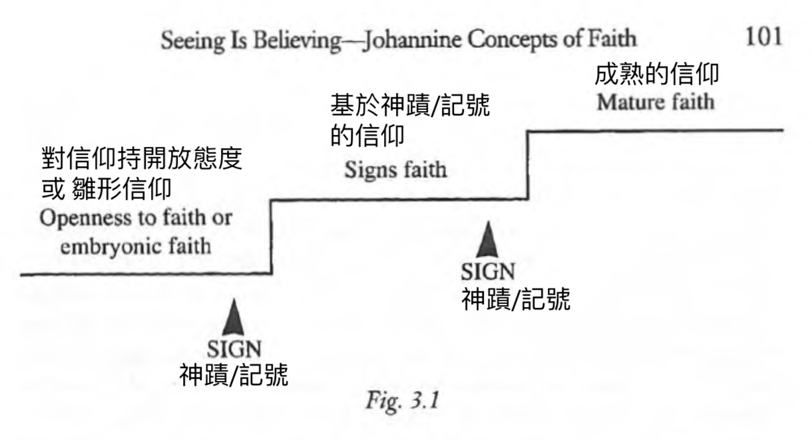
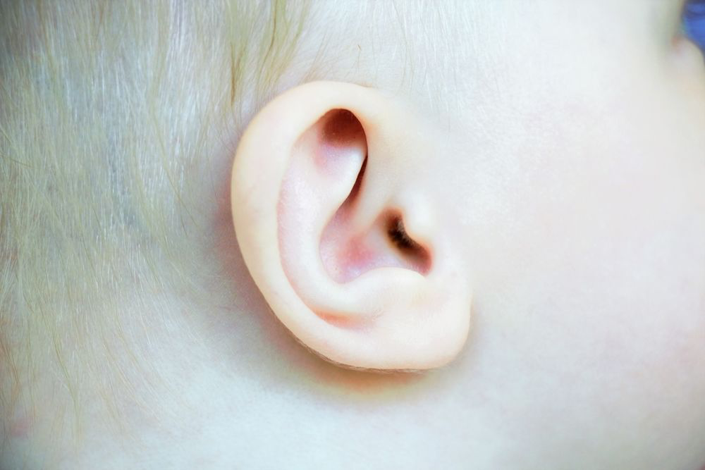
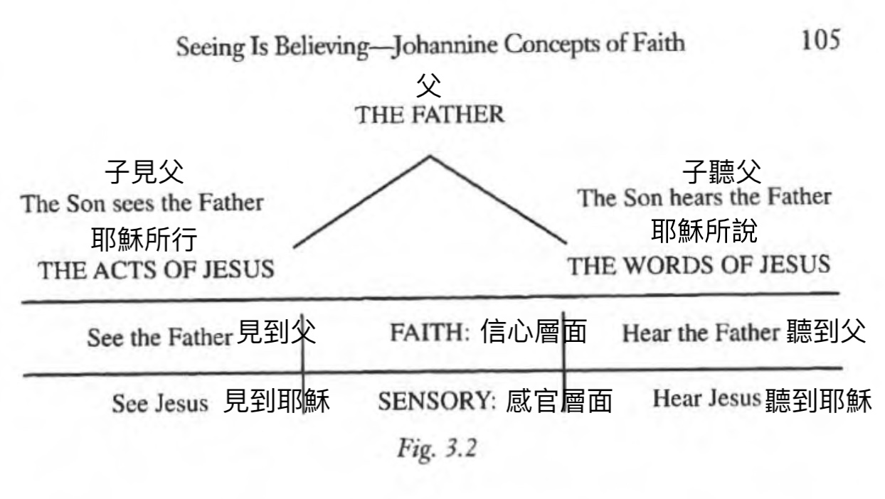
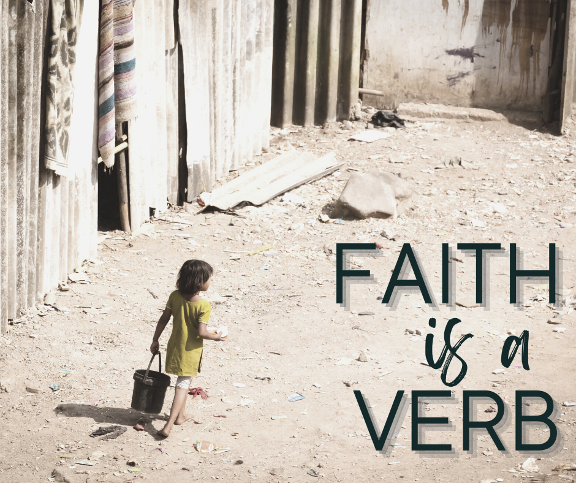

# 眼見為真：約翰福音的「信」 Seeing is believing: Johannine Concepts of Faith
Barry Lee 李萬基 2022.07.24

## Q&A 問與答

「信耶穌有永生，為何依家仍會死？」

- rephrase: 信耶穌[的人]有永生，為何[在今世]仍會死？
- 3:16 「上帝愛世人，甚至將他獨一的兒子賜給他們，叫一切信他的人不致滅亡，反得永生。
- what if: no death and people live eternally on earth => overpopulation  如果：沒有死亡，人們永遠生活在地球上 => 人口過剩
- Also, will people choose not to believe? 還有，人們會選擇不相信嗎？
- no death, no resurrection 沒有死亡，沒有復活
- even if being taken, there'd be a transformation. Would that transformation mean the end (death) of the old self? 就算「被提」，也要經歷轉化。這種轉化是否意味著舊自我的終結（死亡）
- "Death as transformation" 死亡作為轉化的死亡
- After-LIFE: Luke 23:43 耶穌對他說：「我實在告訴你，今日你要同我在樂園裏了。」
- "The “already but not yet” tension in John’s Gospel is distinctly central, for the one who believes “has [present tense] eternal life” (Jn 3:15; 5:24a) and also “will not be [future tense] judged” (Jn 5:24b), because such persons have already “crossed over from death to life” (Jn 5:24c). A change of realms has taken place (cf. Rom 5:12–6:11), and eternal life is a present possession. This is restated in John 6:54, where those who fully encounter Jesus [] immediately “have eternal life,” and Jesus will “raise them up at the last day” (cf. Jn 10:10; 17:3)."[^1] “約翰福音中‘已經但尚未’的張力顯然是核心，因為相信「有永生」（現在式）（約翰福音 3:15；5:24a），並且「（將）不至於被定罪」（將來式）（約翰福音 5:24b），因為這些人已經「出死入生」（約翰福音 5:24c）。 這裏發生領域的變化（參見羅 5:12-6:11），並且永生是「現有的」。約翰福音 6:54 重申了這一點，在那裡，那些完全遇到耶穌 的人立即「有永生」，耶穌也會「在末日使他們復活」。

- Beyond the scope: 信耶穌[的人]有永生，為何[在今世]仍會經歷苦難？

## 1   眼見為真：約翰福音的「信」 Seeing is believing: Johannine Concepts of Faith

- Robert Kysar, “Seeing Is Believing: Johannine Concepts of Faith,” in _John:_ _The_ _Maverick Gospel,_ 3rd Ed. (Louisville: Westminster John Knox Press, 2007), 93-113.
- "Believing originates from an experience or a search for an experience." (p. 94) “「相信」源於一種體驗或對一種體驗的追求。”
- "While a religion cannot usually make any claim that its position is proven or scientifically verified, it can nonetheless suggest that experience points in the direction of the validity of its claims." (p. 94) “雖然一個宗教通常不能聲稱其立場已得到科學證實，但它仍然可以說，經驗指向其立場的有效性。”
- "We might say, then, that in religion there is often a preexperiential faith and an experiential faith: one that precedes the supportive experience and one that results from the experience." (p. 95) “那麼，我們可以說，在宗教中，通常存在一種「體驗前」的信仰和一種「體驗中」的信仰：一種沒有經驗來支持，另一種則源於經驗。”

### 1.1   Questions 本週之謎

believers of later generations 後來信主的門徒
- What experience leads them to faith? 什麼經驗使他們信主？
- Is it the case that the first generation of Christians stood in a privileged position and none of their descendants have hope of such an experientially based faith?  第一代基督徒是否處於特權地位，而他們 之後的信徒，是否沒法經歷同樣的信仰呢？
- Are Christians after that first group doomed to a secondhand experience on which to build their faith? 在第一代之後的基督徒是否注定要靠二手經驗來建立他們的信仰？

Four sections 四個部份
1. The “signs” as provocateurs of faith 神蹟記號挑動信仰
2. Seeing and hearing as faith perception 視聽作為信仰感知
3. Knowing and believing 知道和相信
4. A summary view of faith in the Fourth Gospel 第四福音信仰概要

## 2   The “signs” as provocateurs of faith 神蹟記號挑動信仰

1. What does the Fourth Gospel mean by the word “sign”? 第四福音中的“記號”一詞是什麼意思？
2. What is the role of the signs in initiating and nurturing faith in Christ? 神蹟在發起和培養對基督的信心方面的作用是什麼？2:1-11, 18-25; 4:46-54; 5:1-9; 6:1-28; 9:1-12; 11:1^6; 12:37-41: 20:30-31; 21:1-14. Also read the narrative concerning Thomas in 另請閱讀關於多馬的敘述20:24-29.

Major signs: 主要神蹟/記號

1. Changing the wate into wine (2:1-11) 變水為酒
2. Healing the nobleman’s son (4:46-54) 醫治大臣的兒子
3. Healing the man who had been crippled for thirty-eight years (5:1-9) 醫治殘廢三十八年的人
4. Feeding the multitude (6:1-14) 五餅二魚
5. Walking on the water and the miraculous landing (6:15-25) 水上行走與奇蹟著陸
6. Healing the man born blind(9:1-8) 醫治天生瞎眼的人
7. Raising Lazarus(11:1-46) 拉撒路復活
8. Catching a miraculous number of fish (21:1-14) (p. 96) 捕捉到數量驚人的魚獲

- physical elements; lead to faith 物質元素；導致信仰
- "The implication is that these signs are evidence that Jesus really is the Messiah (e.g. 2:18)." (p. 97)  “這些神蹟/記號就是顯示耶穌是彌賽亞的證據
- "However, the evangelist seems to draw a line between believing in Jesus for the sake of his wondrous acts and “seeing signs.”" (p. 97) “然而， 福音書作者似乎認為對耶穌有兩種「信」，一是要為看耶穌行神跡， 二是真正「看見」神蹟而信。”
- 6:26 "You are looking for me, _not_ _because__you saw signs,_ but because you ate your fill of the loaves" 我實實在在地告訴你們，你們找我，並不是因見了神蹟，而是因吃餅吃飽了
- Do we sometimes seek the thrilling satisfaction or clear benefits of  the signs? 我們有時尋求神跡，是因當中帶來的興奮或好處嗎？
- "that attraction to Jesus in the hope of getting something to eat or of **profiting physically or materially** in other ways is not the same as **following him as a result** of “seeing the signs” he has done." (p. 97)  “有人被耶穌吸引，是希望「有飽飯食」或物質上獲益， 不同於由於看見神跡而跟隨祂。
	- healing 醫治? 
	- material benefits 物質利益? 
	- career 職業? 
	- pure excitement 純興奮? 
- "the evangelist has proposed two levels of experiencing the signs of Jesus: “作者提出了兩個層面來經歷耶穌的神蹟：
	- At one level they present a perception ofJesus as one who fills **human physical needs**. 在某個層面上，他們將耶穌視為滿足**人生存需要**的人。
	- At another level they nurture an awareness of Jesus as the **divine revealer**. (p. 97) 在另一個層面上，他們培育了對耶穌作為**神聖啟示者**的認識。
	- a positive spin: "a positive means of provoking faith in people." 正面來看：“激發人們信心的積極手段。”
	- a negative spin: "the Fourth Gospel has much more serious reservations about the effectiveness of signs in producing genuine faith." 負面來看：“第四福音對神跡會否帶動真實的信仰，似乎抱有保留。”
- 12:37 Even after Jesus had performed so many signs in their presence, they still would not believe in him. 他雖然在他們面前行了許多神蹟，他們還是不信他。
- "Jesus did the healing (4:46–53) only after complaining about belief based on signs and wonderful acts. Is verse 48 of this story a mild rebuke of an excessive dependence on signs as the basis of faith?" “耶穌抱怨人要看見神蹟才信，然後才進行了醫治（4:46-53）。這個故事中第 48 節是對過度依賴神蹟作信仰基礎的溫和譴責嗎？”
- 4:48 “Unless you people see signs and wonders,” Jesus told him, “you will never believe.” 耶穌對他說：「若不看見神蹟奇事，你們總是不信。」
- Faith founded on signs is a legitimate, mature faith, so long as it is not self-seeking. 建立在神蹟上的信仰可以是合理和成熟的信仰，只要它不是但求自我的。
- "Verse 48 is nothing more than a test of the nobleman’s faith. The officer expressed his continuing confidence in Jesus in verse 49." (P. 98) “也許第 48 節只不過是對大臣信仰的考驗。大臣在第 49 節中表達了他對耶穌的持續信心。”
- Three corrective views about signs: 關於標誌的三種糾正觀點：
	1. "signs-faith is **not faith** at all, the Gospel claims. It is self-seeking satisfaction." “神蹟-信仰並**不是信仰**（福音聲稱）。它只是尋求自我的滿足。”
	2. "Faith may begin with a dependence on signs, but it **must grow** out of that dependence until it matches the faith mentioned in 20:29 (“Blessed are those who have not seen and yet have come to believe”)." “信心可能始於對神蹟的依賴，但它**必須從這種依賴中成長**，直到它與 20:29 中提到的信心相匹配（“那些沒有看見就信的人有福了”）。 "
	3. "signs-faith is not faith, rather it is a valuable **first step** in the process toward faith." (p. 98-99) “神蹟-信仰不是信仰，而是通往信仰的過程中寶貴的**第一步**。” 
 - bike-riding 踏單車
- "Insofar as we may call faith an openness to the possibility of God’s reality and activity, the signs _require_ faith as well as _provoke_ faith." (p .100) “我們可以稱信仰為對上帝的現實和活動持「開放態度」，神蹟需要信心，也激發信心。”

- mature faith 成熟的信仰: 20:29 blessed are those who have not seen and yet have believed. 那沒有看見卻信的有福了。

## 3   Seeing and hearing 看見和聽見

Look at the ways in which the words meaning “to see” are used throughout the Gospel. Try to discern some pattern in the author’s use of these words in 1:14, 50-51; 3:11, 32; 5:19; 6:40; 9:39; 14:7, 9; 17:24; 19:35-37; 20:8, 25, 29.  看看在福音書的經文中，“看”這個的字眼是如何使用的。

### 3.1   Seeing 看見

- "The Greek words for seeing are used in the Fourth Gospel interchangeably for a sensory perception and a faith perception." (p. 102) “希臘語中的“看見”一詞在第四福音中同樣地用於「感官知覺」和「信仰感知」。
- 6:40 For my Father’s will is that everyone who **looks to** the Son and believes in him shall have eternal life, and I will raise them up at the last day.” 因為我父的旨意是要使每一個**見了**子而信的人得永生，並且在末日我要使他復活。
- 11:45 Therefore many of the Jews who had come to visit Mary, and **had seen** what Jesus did, believed in him. 於是來看馬利亞的猶太人中，有很多人**見了**耶穌所做的事，就信了他。
- "the origin of faith is based on the contact with the earthly Jesus." (p. 103) “信仰的起源是基於在世上與耶穌接觸。”
- "faith is rooted in direct experience, but goes beyond the “usual sensory experience” to affirm more than the sheer observable data itself will substantiate." (ibid.) “信仰雖植根於直接經驗，但超越”一般的感官經驗”，比純粹的可觀察的東西更實在。”
- "Religious faith is not a result of pure meditation in which one withdraws from contact with the world into contact only with one’s body or some spiritual reality beyond the self. - “宗教信仰不是純粹冥想出來的結果，在這種冥想中，一個人從世界的接觸中抽離，只與自己的身體，或某種超越自我的靈體來接觸。
- John [] affirms that faith arises from contact with an earthly and worldly object." 約翰 [] 肯定了「信心」來自於與「在世」事物的接觸。”
- kiss親吻；love愛
- 9:39 Jesus said, “For judgment I have come into this world, so that the blind will see and those who see will become blind.” 耶穌說：「我為審判到這世上來，使不能看見的看見，能看見的反而失明。」
	- seeing: "Jesus grants the gift of perceiving the truth about life and existence. He gives the possibility of comprehension so that one may correct misconstrued self-understanding." (ibid.) 看見：“耶穌 的恩賜讓我們可以體會生命和存在的真相。他賜予我們理解的能力，以便可以糾正錯誤的自我理解。”
	- not seeing (being blind) means having a distorted view about life, existence and self. 看不見（失明）意味著對生命、存在和自我有一種扭曲的看法。

### 3.2   Hearing 聽見

- 5:24 “Very truly I tell you, whoever hears my word and believes him who sent me has eternal life and will not be judged but has crossed over from death to life. 「我實實在在地告訴你們，那聽我話又信差我來那位的，就有永生，不至於被定罪，而是已經出死入生了。
- "[F]aith-hearing [] is not the sensory experience of sound but the act of discerning the presence of the Ultimate in this man, Jesus." (p. 104) “[F] aith-hearing [] 「信-聽」不單是聽聲的感官體驗，而是認出「耶穌在此」，和耶穌就是終極的那位。

- "This author seems to use “seeing” and “hearing” to refer to something deeper than physical seeing or hearing. These words represent the apprehension of truth or the comprehension of the presence of a divine agent." (ibid.) “ 福音作者似乎用「看」和「聽」來指代比肉體看或聽更深的東西。這些動詞代表了對真理的拿捏，或對這「神人在此」的理解。”

- two levels: sensory and symbolic 兩個層次：感官和象徵

- "Johannine treatments of the signs and the metaphorical use of the verbs “to see” and “to hear” is in the profoundest sense sacramental." (p. 105) “約翰不論寫「神蹟/符號」，和對‘看’和‘聽’的隱喻，都標誌着深厚的神聖或聖禮般的意義。”

- "The physical, the sensory, the material is the medium by which faith is born. What we see, hear, touch, smell, or otherwise experience is our connection with the divine." (ibid.) “物質、感官、物質是可以讓信仰誕生的媒介。我們所見、所聽、所觸、所聞或以其他方式體驗到的是我們與神性的聯繫。”
	- examples: baptism, bread, wine 例子：洗禮、餅、杯
- first batch of believers 第一批信徒
- "The Gospel means too that every Christian’s faith is born from the perceptual experiences. The Christ of faith is still experienced in the community of believers and in the poor and needy of our world. From the hearing of Christian preaching and witness and from the concrete acts done in Christian love, faith is continually bom." “福音也意味著每個基督徒的信仰都是從感官的經歷中誕生的。信仰中的基督仍然在信徒群體，和這世界中的窮人和有需要的人中被體驗到。從聽講道和見證，以及一些彰顯基督的愛的具體行為中，信仰是「不斷誕生」的。” (p. 106)

## 4   Knowing and believing 知道和相信

- "Is there a requisite knowledge one must have before faith? Or is faith the foundation for knowing?" (p. 106) “在「信」之先是否需要一些必要的知識？ 還是信仰就是知識的基礎？”

Reader’s Preparation: The necessary reading for our brief discussion of this subject will be satisfied by the following passages: 6:69; 8:31-32; 17:7-8, 21-23. As you read these passages, ask yourself: Which comes first in the Johannine scheme—knowing or believing? Is one more important than the other? Are they synonyms? 預備討論，請讀以下段落：6:69； 8:31-32； 17:7-8, 21-23。當你閱讀這些段落時，問問自己：在約翰的計劃中，哪一樣東西首先存在——「知識」還是「相信」？一個比另一個更重要嗎？他們是同義詞嗎？

6:69 We have come to believe and to know that you are the Holy One of God. 我們已經信了，又知道你是上帝的聖者。

8:31–32 To the Jews who had believed him, Jesus said, “If you hold to my teaching, you are really my disciples. Then you will know the truth, and the truth will set you free.” 耶穌對信他的猶太人說：「你們若繼續遵守我的道，就真是我的門徒了。 你們將認識真理，真理會使你們自由。」

17:7-8 Now they know that everything you have given me comes from you. For I gave them the words you gave me and they accepted them. They knew with certainty that I came from you, and they believed that you sent me. 現在他們知道，你所賜給我的一切都是從你那裏來的； 因為你所賜給我的話，我已經賜給他們，他們也領受了，又確實知道，我是從你出來的，並且信你差了我來。

- faith -> knowledge 信仰->知識
- knowledge -> knowledge 知識 -> 知識
- faith = knowledge 信仰=知識

- "What the Gospel means by “to know” may be no different from what is meant by “to believe.”" (p. 107) “福音中‘知道’的意思可能與‘相信’的意思沒有什麼不同。”
- gnoskein (Greek 希臘語), yada (Hebrew 希伯來語)  
- "Faith is the trusting personal relationship between two subjects. It is an interchange on a most intimate level. Belief must not then mean merely the intellectual acceptance of doctrine" (ibid.)  “信仰是兩個主體之間相互信任的個人關係。它是一種最親密的交流。信仰不能僅僅意味著在理智上接受教義”
- "faith involves the whole person (mind, body, emotions, and all the rest) in a personal relationship." (ibid.) “信仰涉及個人關係中的整個人（思想、身體、情感和所有其他方面）。”

## 5   Believe in what? 相信什麼？

- 98 times "believe" 98 次“相信”
- objects of faith: 信些什麼？
	- Jesus (4:39 Many of the Samaritans from that town believed in him 好些撒瑪利亞人信了耶穌)
	- Jesus's word (2:22 After he was raised from the dead, his disciples recalled what he had said. Then they believed the scripture and the words that Jesus had spoken. 所以他從死人中復活以後，門徒想起他曾說過這事，就信了聖經和耶穌所說的話。 )
	- Creed (11:27 Yes, Lord,” she replied, “I believe that you are the Messiah, the Son of God, who is to come into the world.” 馬大對他說：「主啊，是的。我信你是基督，是上帝的兒子，就是那要臨到世界的。」)
- gradual shift 逐漸轉變
   - from personal allegiance to a creedal understanding of faith 由個人對信仰的忠誠，演化為對信條的理解
- "The Johannine Christians doubtless believed that a personal relationship with Christ leads naturally and logically to faith statements about who that Christ is. In other words, the motive for the rise of the creedal concept of faith is the desire to speak honestly and clearly about the Christ figure." (p. 111) “「約翰群體」中基督徒無疑相信，與基督的個人關係自然地，也合乎邏輯地，演變成「基督是誰」的信仰陳述。換句話說，信條的興起是基於渴望清楚誠實地講論基督。

## 6   Faith as a verb 信為動詞

- grammar: NEVER the noun 'faith' or 'belief', but ALWAYS the verb 'to believe' (ibid.) 語法上： [在福音書裏]從來都不是用名詞“faith”(e.g. 信心) 或“belief” (e.g. 信仰) 來表達，而是用動詞“to believe”「信」（同上）
- "Faith is not an inner disposition. Faith is not something one _has._ Faith is something one _does_ or what is done for you. Faith is not a state of being but is dynamic becoming." (ibid.) “信仰不是一種向內的心態。信仰不是一個人「有」或「沒有」的東西。信仰就是你「所做的一切」，和[上帝]為你「所做的一切」。信仰不是一種靜態的「存在」，而是一種 動態的「進程」。”
- "If faith is always a verb, that surely implies that faith is not something one does once and for all time. Rather, faith as a verb means that believing is a decision made once, only to have to be made over and over again, or a gift accepted not once but again and again." (ibid.) “如果「信」是一個動詞，那意味著信仰不是一樣「一勞永逸」（或「一take過」）的事情。反之，作為動詞的信仰意味著「信」不只是一個決定，而是持續反覆要作一連串決定；「信」不是一次過的禮物，而是持續反覆一連串可接受的禮物。

## 7   Conclusion 結論

- "The initial faith is the work of God—the divine drawing, the giving over of the individual to Christ." “人經歷起初的信心是上帝的工作——是一種神聖的吸引，將個人交給基督。”
- "That initial gift of faith opens the eyes, so that faith-perception might be possible."  “起初的信心是一種恩賜，打開了眼睛，以至人可以用感知來認識信仰(「信仰感知」)。”
- "Beyond that initial sensitizing of one to the experience of divine presence, the human is then responsible for believing and growing in faith." “人先經歷上帝的同在和對祂的敏銳， 然後還有責任持續相信，並在信仰中成長。”
- "Humans can never boast of their faith, for it originates with God’s act in their lives. Nor can humans ever abdicate responsibility for the maturation of faith." (p. 112) “人永遠不能誇耀他們的信心，因為信心源於上帝在他們生命中的作為。人也永遠不能背棄責任，不讓信仰一步一步成熟起來。” 

[^1]: G. R. Osborne, [“Life, Eternal Life,”](https://ref.ly/logosres/dctjssgsscnddtn?ref=Page.p+521&off=4331&ctx=fe+by+the+believer.+~The+%E2%80%9Calready+but+not) ed. Joel B. Green, Jeannine K. Brown, and Nicholas Perrin, _Dictionary of Jesus and the Gospels, Second Edition_ (Downers Grove, IL; Nottingham, England: IVP Academic; IVP, 2013), 521.
